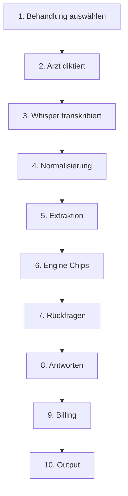

# 02 — Klinischer Workflow

> **Stand:** 2025-12-12  
> **Source of Truth:** V6 UI + TreatmentEngine

---

## Der 10-Schritte Behandlungsablauf



---

## Schritte mit Status

| Schritt | Beschreibung | Status | Nachweis |
|---------|--------------|--------|----------|
| 1 | Behandlung auswählen | **PROVEN** | V6 UI Dropdown |
| 2 | Diktat | **PROVEN** | Whisper API |
| 3 | Transkription | **PROVEN** | Whisper API |
| 4 | Normalisierung | **PROVEN** | 58 Ugly Whisper Tests |
| 5 | Extraktion | **PROVEN** | 62 Golden Master Tests |
| 6 | Chip-Inferenz | **PROVEN** | treatmentEngine.ts |
| 7 | Rückfragen | **PROVEN** | questionService.ts |
| 8 | Antworten | **PROVEN** | V6 QuestionsStep |
| 9 | Billing | **PROVEN** | 23 Billing Tests |
| 10 | Output | **PROVEN** | 147 Golden Output Tests |

---

## Pre-Dictation Settings

| Toggle | Status | Nachweis |
|--------|--------|----------|
| GKV / PKV / GKV+MKV | **PROVEN** | 10 Golden Fixtures |
| Behandlungstyp | **PARTIAL** | Nur Füllung |
| Kinder/Erwachsene | **NOT TESTED** | Nicht implementiert |
| Sitzungstyp | **NOT TESTED** | Nicht implementiert |

---

## Multi-Treatment Segmentierung

| Komponente | Status | Nachweis |
|------------|--------|----------|
| Engine-Architektur | **PROVEN** | treatmentEngine.ts |
| Diktat-Segmentierung | **NOT TESTED** | Nicht implementiert |
| UI Multi-Segment | **NOT TESTED** | Nicht implementiert |

**Entscheidung:** Multi-Treatment = **POST-MVP**

---

## Beispiel-Diktat

```
"36 mod tief, kofferdam, LA. 35 endo begonnen, trep, med, kanäle 2."
```

| Segment | Status |
|---------|--------|
| Füllung (36) | **PROVEN** |
| Endo (35) | **NOT TESTED** (JSON fehlt) |
