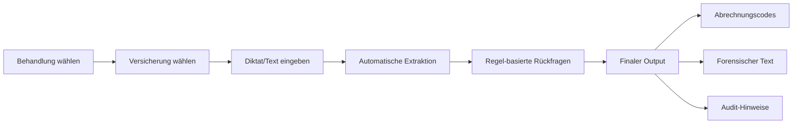
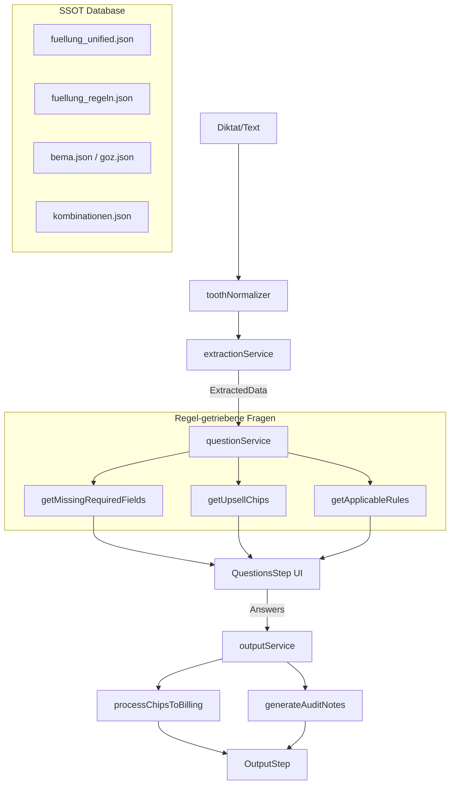

# Docudent Masterplan V3.5 — Regel-getriebene Abrechnungsarchitektur

> **Stand:** 2025-12-11  
> **Version:** 3.5  
> **Status:** ✅ Vollständig synchronisiert — Datenbank = Gehirn

---

## 0. Executive Summary

**Docudent** ist ein KI-gestütztes Dokumentations- und Abrechnungssystem für Zahnärzte.

**Kernprinzip:** *Der Arzt diktiert nur variable Informationen — das System erledigt alles andere.*

### Technischer Ansatz

- **Single Source of Truth (SSOT):** Alle Abrechnungscodes, Regeln, Pflichtfelder und Dokumentationstexte stammen ausschließlich aus JSON-Datenbanken
- **Regel-getriebene Engine:** Fragen entstehen aus Regeln und Pflichtfeldern, nicht aus Templates oder LLM-Intuition
- **Regresssicherheit:** Automatische Prüfung auf Kombinationsverbote und Dokumentationspflichten
- **Universelles Schema:** Alle Behandlungstypen folgen demselben Chip-Schema

---

## 1. Produktvision & Praxis-Workflow

### 1.1 Kerngedanke

> „Arzt diktiert nur variable Informationen — das System erledigt alles andere."

Das System übernimmt:
- Forensische Dokumentation
- Abrechnungsoptimierung
- Regress-Vermeidung
- Upsell-Vorschläge

### 1.2 Beispiel-Workflow



### 1.3 Die 3 Versicherungsklassen

| Mode | Beschreibung | Billing-Verhalten |
|------|--------------|-------------------|
| **GKV** | Gesetzlich | Nur BEMA-Codes, Kassenleistung |
| **GKV + MKV** | Gesetzlich mit Mehrkostenvereinbarung | BEMA + GOZ für Zuzahlung |
| **PKV** | Privat | Nur GOZ-Codes, höhere Faktoren |

### 1.4 Unterstützte Behandlungsarten

| Behandlung | Status | JSON-Datei |
|------------|--------|------------|
| Füllung (Komposit) | ✅ Implementiert | `fuellung_unified.json` |
| Endodontie | 🔜 Geplant | `endo_unified.json` |
| Chirurgie | 🔜 Geplant | `chirurgie_unified.json` |
| Prophylaxe/UPT | 🔜 Geplant | `prophylaxe_unified.json` |
| Prothetik | 🔜 Geplant | `prothetik_unified.json` |

---

## 2. Systemübersicht (High-Level Architecture)

### 2.1 Komponenten-Überblick

```
src/
├── docudent/
│   ├── core/                       # ← SINGLE SOURCE OF TRUTH
│   │   └── billing/knowledgeBase/
│   │       ├── behandlungen/       # Behandlungs-JSONs (Chips, Regeln)
│   │       │   └── fuellung_unified.json
│   │       ├── kataloge/           # BEMA/GOZ Kataloge
│   │       │   ├── bema.json
│   │       │   └── goz.json
│   │       ├── regeln/             # Regel-Datenbanken
│   │       │   ├── kombinationen.json
│   │       │   └── fuellung_regeln.json
│   │       └── logic/
│   │           └── treatmentEngine.ts  # ← ZENTRALE ENGINE
│   │
│   └── v6/                         # ← AKTIVE UI (Hero-Flow)
│       ├── hooks/useDocudentV6.ts
│       ├── services/
│       │   ├── extractionService.ts
│       │   ├── toothNormalizer.ts
│       │   ├── questionService.ts      # Regel-getrieben!
│       │   └── outputService.ts
│       └── pages/DocudentV6Page.tsx
```

### 2.2 Single Source of Truth (SSOT)

> **Datenbank = Gehirn**

| Element | Quelle | NIE im Code |
|---------|--------|-------------|
| Abrechnungscodes | `chips.billingRef` → Kataloge | ❌ Keine hardcoded BEMA/GOZ |
| Dokumentationstexte | `chips.textSnippets` | ❌ Keine handgeschriebenen Texte |
| Regeln & Warnungen | `regeln/*.json` + `chips.ruleRefs` | ❌ Keine fachlichen Sonderregeln |
| Rückfragen | `chips.requiredFields` + Regeln | ❌ Keine Template-Listen |

### 2.3 V6 Hero-Flow



---

## 3. Datenbank-Architektur

### 3.1 Behandlungsspezifische JSON-Dateien

Jede Behandlung hat eine eigene `*_unified.json` Datei mit identischem Schema.

**Pfad:** `src/docudent/core/billing/knowledgeBase/behandlungen/`

### 3.2 Erweitertes Chip-Schema (V2)

Jeder Chip enthält:

```typescript
interface ChipDefinition {
    // Identifikation
    id: string;                    // "kofferdam", "la_leitung"
    label: string;                 // "Kofferdam", "LA Leitung"
    phase: string;                 // "befund", "anaesthesie", "fuellung"
    category: 'befund' | 'leistung';
    
    // Dokumentation
    textSnippets: {
        kurz: string;              // "Kofferdam."
        mittel: string;            // "Kofferdam angelegt."
        lang: string;              // Ausführlicher forensischer Text
    };
    
    // Abrechnung
    billingRef: {
        GKV?: string;              // "BEMA_12"
        PKV?: string;              // "GOZ_2040"
        MKV?: string;              // "GOZ_2197"
    } | null;
    
    // NEU: Regel-getriebene Felder
    requiredFields?: string[];     // ["zahn", "flaechen"]
    ruleRefs?: string[];           // ["RULE_KOFFERDAM_PFLICHT"]
    forensicNotes?: string[];      // ["Kofferdam MUSS dokumentiert sein!"]
    
    // NEU: Upsell
    upsellCandidate?: boolean;     // true für Mehrkosten-Chips
    upsellNotes?: string[];        // ["Nur bei PKV abrechenbar"]
    
    // Steuerung
    mutuallyExclusiveWith?: string[];
    defaultActive?: boolean;
    showInQuickView?: boolean;
}
```

### 3.3 Regel-Datenbank

**Pfad:** `src/docudent/core/billing/knowledgeBase/regeln/`

Jede Behandlung hat eine eigene Regel-Datei (z.B. `fuellung_regeln.json`):

```typescript
interface RuleDefinition {
    id: string;                    // "RULE_KOFFERDAM_PFLICHT"
    appliesTo: string[];           // ["kofferdam"]
    shortSummary: string;          // "Kofferdam muss dokumentiert sein"
    
    // Trigger-Bedingungen
    triggerField?: string;         // "isolation"
    triggerValue?: string;         // "Kofferdam"
    insuranceCondition?: string;   // "PKV", "GKV", "MKV"
    
    // Risiko & Aktionen
    riskLevel: 'hoch' | 'mittel' | 'niedrig';
    regressRisk?: boolean;         // Regress-Gefahr
    questionTrigger?: boolean;     // Generiert Rückfrage
    questionText?: string;         // Custom Fragetext
    
    // Audit-Output
    auditWarning?: string;         // "BEMA 12 ohne Kofferdam = REGRESS!"
    auditOptimization?: string;    // "GOZ 0080 nicht vergessen"
    
    source: string;                // "BEMA-Kommentar zu Nr. 12"
}
```

### 3.4 Katalog-Daten

| Katalog | Pfad | Inhalt |
|---------|------|--------|
| BEMA | `kataloge/bema.json` | Nummern, Bezeichnungen, Punkte |
| GOZ | `kataloge/goz.json` | Nummern, Bezeichnungen, Beträge (2.3×) |
| Kombinationen | `regeln/kombinationen.json` | Ausschluss-Regeln |

### 3.5 Kombinationsregeln

```json
{
    "id": "goz2197_nicht_neben_2060",
    "typ": "ausschluss",
    "betrifft": ["GOZ_2197", "GOZ_2060"],
    "beschreibung": "GOZ 2197 nicht neben GOZ 2060-2120",
    "schweregrad": "regress"
}
```

---

## 4. Extraction Layer

### 4.1 Tooth Normalizer

**Pfad:** `src/docudent/v6/services/toothNormalizer.ts`

Die Normalisierung läuft **VOR** jeder Extraktion:

| Eingabe | Normalisiert | Typ |
|---------|--------------|-----|
| `sechsunddreißig`, `elf` | `36`, `11` | Deutsche Zahlwörter |
| `drei sechs`, `eins eins` | `36`, `11` | Gesprochene Paare |
| `360`, `110` | `36`, `11` | Whisper-Fehler (trailing 0) |
| `3-6`, `36a` | `36` | Format-Bereinigung |

**FDI-Validierung:**
- Quadrant 1: 11-18 (OK rechts)
- Quadrant 2: 21-28 (OK links)
- Quadrant 3: 31-38 (UK links)
- Quadrant 4: 41-48 (UK rechts)

**Smart Anästhesie-Inferenz:**
```typescript
requiresLeitungsanaesthesie('36') // → true (UK Molar)
requiresLeitungsanaesthesie('16') // → false (OK)
```

### 4.2 Extraktion aus Diktat

**Pfad:** `src/docudent/v6/services/extractionService.ts`

Extrahierte Felder:

| Feld | Beispiel | Methode |
|------|----------|---------|
| `tooth` | `"36"` | Normalizer + Regex |
| `surfaces` | `["m", "o", "d"]` | Regex |
| `diagnosis` | `"Caries profunda"` | LLM |
| `mentioned.anesthesia` | `{ type: "leitung" }` | Keywords |
| `mentioned.kofferdam` | `true` | Keywords |

---

## 5. Treatment Engine

**Pfad:** `src/docudent/core/billing/knowledgeBase/logic/treatmentEngine.ts`

### 5.1 Aufgabe

Die TreatmentEngine ist die **zentrale Abrechnungs- und Dokumentationsengine**.  
Sie ist die einzige Stelle, die Chips zu Billing-Codes und Text mappt.

### 5.2 Funktionen

| Funktion | Beschreibung |
|----------|--------------|
| **Chip-Management** | |
| `loadTreatmentJSON()` | Lädt Behandlungs-JSON |
| `getTreatmentChips()` | Gibt alle Chips zurück |
| `inferChipsFromDictation()` | Keywords → aktive Chips |
| `resolveChipStates()` | Priorität: User > Diktat > Settings > Default |
| **Billing** | |
| `processChipsToBilling()` | Chips → Codes + Text (SSOT!) |
| `lookupBillingCode()` | Code → Punkte/Betrag aus Katalog |
| `checkCombinationConflicts()` | Regress-Prüfung |
| **Regel-Engine (NEU)** | |
| `loadRules()` | Lädt Regeln aus JSON |
| `getMissingRequiredFields()` | Fehlende Pflichtfelder → Fragen |
| `getApplicableRules()` | Aktive Regeln für Chips |
| `getUpsellChips()` | Upsell-Kandidaten nach Versicherung |
| `generateAuditNotes()` | Warnungen + Optimierungen |
| `shouldAskQuestion()` | Prüft ob Regel Frage triggert |

### 5.3 Insurance Handling

```typescript
// Billing-Code Auswahl nach Versicherungstyp
if (hasMKV && chip.billingRef.MKV) {
    codeId = chip.billingRef.MKV;           // GOZ (Zuzahlung)
} else if (insuranceType === 'GKV' && chip.billingRef.GKV) {
    codeId = chip.billingRef.GKV;           // BEMA
} else if (insuranceType === 'PKV' && chip.billingRef.PKV) {
    codeId = chip.billingRef.PKV;           // GOZ
}
```

### 5.4 Audit-Mechanismus

Die Engine generiert automatisch:

| Typ | Quelle | Beispiel |
|-----|--------|----------|
| **Warnungen** | `regressRisk: true` | "BEMA 12 ohne Kofferdam = REGRESS!" |
| **Optimierungen** | `auditOptimization` | "GOZ 0080 bei PKV nicht vergessen" |
| **Forensisch** | `forensicNotes` | "Material MUSS dokumentiert werden" |

---

## 6. Question Engine (regelgetrieben!)

**Pfad:** `src/docudent/v6/services/questionService.ts`

### 6.1 Prinzipien

> **Fragen entstehen durch Regeln und Pflichtfelder, nicht kreativ.**

- ❌ Keine `MKV_QUESTIONS` Arrays
- ❌ Keine `if (diagnosis.includes('profunda'))` Logik
- ✅ Fragen aus `getMissingRequiredFields()`
- ✅ Fragen aus `upsellCandidate: true`
- ✅ Fragen aus `questionTrigger: true` Regeln

### 6.2 Kategorien

| Kategorie | Quelle | Beispiel |
|-----------|--------|----------|
| **Forensik** | `requiredFields` fehlend | "Sensibilitätsprobe?" |
| **Regel** | `questionTrigger: true` | "Kavitätentiefe?" |
| **Upsell** | `upsellCandidate: true` | "Kofferdam verwendet?" |
| **MKV** | MKV-spezifische Chips | "Mehrschichttechnik?" |

### 6.3 Beispiele pro Behandlungstyp

**Füllung:**
- Fehlendes `vitality` → "Sensibilitätsprobe?"
- Upsell `kofferdam` → "Kofferdam verwendet?"
- MKV aktiv → "Zuzahlungsbetrag?"

**Endodontie (geplant):**
- Fehlendes `kanalanzahl` → "Wie viele Kanäle?"
- Regel `ROENTGEN_PFLICHT` → "Röntgen prä-OP?"
- Upsell `elektr_laenge` → "Elektrische Längenmessung?"

---

## 7. UI/Frontend Flow (V6)

**Pfad:** `src/docudent/v6/pages/DocudentV6Page.tsx`

### 7.1 Hero-Flow

Der V6 Hero-Flow besteht aus 3 Steps:

```
[Dictation] → [Questions] → [Output]
```

**DictationStep:**
- Textarea für Texteingabe
- Mikrofon-Button für Whisper
- Versicherungsmodus (Jeton-Style)
- "Analysieren" Button

**Versicherungswahl:**
```
[ 🏥 GKV ] [ 💳 GKV + MKV ] [ ⭐ PKV ]
```

### 7.2 Questions-Step

Fragen werden in Kategorien gruppiert:

| Gruppe | Icon | Inhalt |
|--------|------|--------|
| Befund | 🔍 | Forensische Pflichtfragen |
| Leistungen | 💡 | Upsell-Optionen |
| Mehrkosten | 💶 | MKV-spezifisch |

**Card-Layout:**
- Frage-Text mit Emoji
- Optionen als Buttons
- Billing-Wert angezeigt
- Pre-Selection aus Diktat

### 7.3 Output-Step

Zwei-Spalten-Layout:

| Links | Rechts |
|-------|--------|
| Behandlungsablauf (Text) | Abrechnungscodes (Pills) |
| Kurz/Mittel/Lang Toggle | BEMA (coral) / GOZ (purple) |
| Kopieren-Button | Hinweise + Optimierungen |

---

## 8. Tests

### 8.1 Unit Tests

| Test-Datei | Tests | Abdeckung |
|------------|-------|-----------|
| `toothNormalizer.test.ts` | 28 | Zahlen, Paare, Fehler, FDI |
| `treatmentEngine.test.ts` | 11 | GKV, MKV, PKV, Kombinationen |

**Ausführen:**
```bash
npx vitest run src/test/toothNormalizer.test.ts
npx vitest run src/test/treatmentEngine.test.ts
```

### 8.2 Integration Tests

| Szenario | Input | Erwartung |
|----------|-------|-----------|
| GKV + UK Molar | "36 mod Kofferdam" | BEMA 41a, BEMA 12, BEMA 13c |
| GKV + MKV | "36 mod Mehrschicht" | BEMA 13c + GOZ 2197 |
| PKV | "15 ob Cp" | GOZ 2060, GOZ 2040, GOZ 2330 |

### 8.3 Regression Tests

- 60+ Splitterfälle für komplexe Szenarien
- Kombinationsregeln-Prüfung
- Edge Cases (devital, profunda, etc.)

---

## 9. Roadmap

### 9.1 Kurzfristig (Q1 2025)

- [ ] `endo_unified.json` + Regeln
- [ ] `chirurgie_unified.json` + Regeln
- [ ] UI-Feinschliff Output-Step
- [ ] E2E Browser-Tests

### 9.2 Mittelfristig (Q2-Q3 2025)

- [ ] Prophylaxe/UPT/PAR
- [ ] BEL-II Integration (Labor)
- [ ] AI-Audit-Layer (2nd Pass)
- [ ] Multi-Zahn Support

### 9.3 Langfristig (2026+)

- [ ] Vollautomatische Abrechnungsfreigabe
- [ ] KI-gestützte Behandlungsanalyse
- [ ] Praxis-Analytics Dashboard
- [ ] API für PVS-Integration

---

## 📋 Quick Reference für LLM-Agenten

### ✅ AKTIV VERWENDEN

| Pfad | Beschreibung |
|------|--------------|
| `treatmentEngine.ts` | **Die Engine** — alle Billing-Aufrufe |
| `src/docudent/v6/` | **Die aktuelle UI** |
| `behandlungen/*.json` | **Die Datenbank** (Chips, Regeln) |
| `regeln/*.json` | **Die Regel-DB** |

### ❌ NICHT VERWENDEN

| Pfad | Grund |
|------|-------|
| `src/_legacy/` | Alte Sonia-Versionen |
| `src/docudent/v5/` | Deprecated |
| Hardcoded BEMA/GOZ | Verstößt gegen SSOT |

### 🔑 Kernprinzipien

1. **Datenbank = Gehirn** — Alle Logik in JSON
2. **Fragen aus Regeln** — Nicht kreativ, nicht geraten
3. **TreatmentEngine = SSOT** — Einziger Weg zu Codes
4. **Versicherung bestimmt Codes** — GKV→BEMA, PKV→GOZ

---

*Bei Fragen zur Architektur: Dieses Dokument zuerst lesen!*
