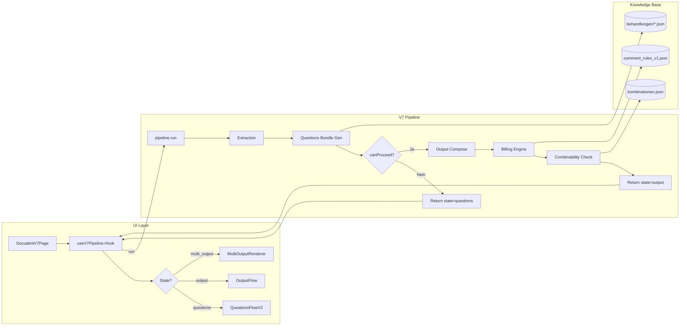

# Docudent V7 — Architektur-Übersicht

> **Git HEAD:** `910f189` | **Stand:** 2025-12-20  
> **Zielgruppe:** Senior Developer (DB / LLM Spezialist) im Onboarding

---

## 1. Elevator Pitch (60s)

Docudent V7 ist ein **deterministisches Dokumentations-System für Zahnärzte**, das aus diktierten Behandlungsbeschreibungen automatisch:

1. **Strukturierten Freitext** für die Patientenakte generiert
2. **Abrechnungscodes** (BEMA/GOZ) mit rechtssicheren Referenzen auslöst
3. **Kombinatorik-Prüfungen** durchführt, um Regress-Risiken zu vermeiden
4. **Mehrbehandlungs-Szenarien** handhabt (2 Füllungen auf 2 Zähnen in einer Sitzung)

**Design-Prinzipien:**
- **SSOT (Single Source of Truth):** `copyText` wird ausschließlich aus Blocks abgeleitet
- **Determinismus:** Gleiche Eingabe → identische Ausgabe, keine Timestamps
- **Gate-First:** Jedes Invariant ist durch einen Gate-Test abgesichert

---

## 2. Was heute gebaut ist

| Fähigkeit | Status | Kanonische Datei |
|-----------|--------|------------------|
| Diktat → Extraktion (Zahn, Flächen, Diagnose) | ✅ | `core/extraction/` |
| Fragen-System mit QuestionBundle | ✅ | `QuestionsFlowV2.tsx` |
| Output-Compose mit BillingRefs | ✅ | `outputComposer.ts` |
| Kombinatorik-Prüfung (WARN/BLOCK) | ✅ | `billingCombinabilityChecker.ts` |
| DB-backed Billing Scope | ✅ | `billingScopeResolver.ts` |
| Multi-Treatment Orchestrierung | ✅ | `multitreatment/orchestrator.ts` |
| Multi-Instance (gleiche Behandlung, mehrere Zähne) | ✅ | `TreatmentInstance` in `types.ts` |
| E2E-Tests mit Playwright | ✅ | `v7/__e2e__/*.e2e.spec.ts` |

---

## 3. End-to-End Datenfluss



### Schritte im Detail

1. **UI → Hook:** `DocudentV7Page` ruft `useV7Pipeline.runPipeline(dictation)` auf
2. **Extraction:** Zahn, Flächen, Diagnose werden aus Diktat extrahiert
3. **Questions:** `generateQuestionsV2Bundle()` lädt Fragen aus `question_bank.json`
4. **canProceed:** Prüft ob alle `required` Fragen beantwortet sind
5. **Wenn Nein:** Rückgabe mit `state: 'questions'` + `questionBundle`
6. **Wenn Ja:** Output wird aus Blocks zusammengesetzt
7. **Billing:** `billingScopeResolver` lädt Scope aus DB
8. **Combinability:** `checkCombinability()` prüft gegen `kombinationen.json`
9. **Return:** `PipelineResult` mit `state: 'output'` + `ComposedOutput`

---

## 4. Modul-Map

```
src/docudent/
├── contracts/               # SSOT Type Definitions
│   ├── pipeline.ts          # PipelineInput, PipelineResult
│   ├── questions.ts         # DynamicQuestion, QuestionBundle
│   ├── compose.ts           # ComposedDocumentV1, BillingRef, CombinabilityResult
│   └── output.ts            # ComposedOutput (legacy)
│
├── core/
│   ├── billing/
│   │   ├── knowledgeBase/
│   │   │   ├── logic/
│   │   │   │   ├── billingScopeResolver.ts   # DB-backed scope
│   │   │   │   └── outputComposer.ts         # SSOT compose
│   │   │   └── rules/comment_rules_v1.json   # 964 Rules mit Scope
│   │   └── combinability/
│   │       └── billingCombinabilityChecker.ts
│   └── playbooks/           # Treatment-spezifische Logik
│       ├── fuellung/        # Füllung Pipeline
│       └── endo/            # Endo Pipeline
│
├── v7/
│   ├── pages/
│   │   └── DocudentV7Page.tsx     # UI Entrypoint
│   ├── hooks/
│   │   └── useV7Pipeline.ts       # State Container
│   ├── pipeline/
│   │   └── index.ts               # run() — Pure Orchestrator
│   ├── components/
│   │   ├── QuestionsFlowV2.tsx    # Fragen-UI
│   │   ├── OutputFlow.tsx         # Output-UI
│   │   └── MultiOutputRenderer.tsx # Multi-Output-UI
│   └── multitreatment/
│       ├── orchestrator.ts        # Multi-Instance/Treatment Execution
│       └── types.ts               # TreatmentInstance, MultiTreatmentResult
│
└── __tests__/gates/              # 90+ Gate Tests
```

---

## 5. Contracts & SSOT

### Kern-Typen

| Type | Datei | Zweck |
|------|-------|-------|
| `PipelineInput` | `contracts/pipeline.ts` | Eingabe: dictation, answers, insuranceType |
| `PipelineResult` | `contracts/pipeline.ts` | State Machine: idle → questions → output |
| `QuestionBundle` | `contracts/questions.ts` | required + optionalVisible + optionalHidden |
| `ComposedDocumentV1` | `contracts/compose.ts` | SSOT: copyText + blocks + billingRefs |
| `CombinabilityResult` | `contracts/compose.ts` | verdict: PASS / WARN / BLOCK |
| `MultiTreatmentResult` | `multitreatment/types.ts` | aggregatedCopyText + perInstanceBundles |
| `TreatmentInstance` | `multitreatment/types.ts` | instanceId + tooth + answers |

### SSOT Invariante

```typescript
// contracts/compose.ts, Zeile 81
// INVARIANT: copyText === blocks.map(b => b.text).join('\n\n')
```

**UI kopiert ausschließlich `aggregatedCopyText` (Multi) oder `output.copyText` (Single).**

---

## 6. Billing & Combinability

### Scope Resolution (P14.3 MF1)

```typescript
// billingScopeResolver.ts
getBillingScopeWithFallback('BEMA_13c') // → 'TOOTH'
getBillingScopeWithFallback('BEMA_40')  // → 'SESSION'
```

**Source:** `comment_rules_v1.json` mit `payload.scope: Zahn|Sitzung|Kiefer|Behandlung`

**Normalisierung:** Zahn → TOOTH, Sitzung → SESSION, Kiefer → JAW, Behandlung → CASE

### Combinability Check

```typescript
// billingCombinabilityChecker.ts
const result = checkCombinability(['BEMA_13a', 'GOZ_2197'], 'fuellung', 'GKV');
// result.verdict: 'PASS' | 'WARN' | 'BLOCK'
// result.conflicts: [{ codeA, codeB, ruleId, reason, severity }]
```

**Source:** `kombinationen.json` mit 50+ Regeln

### UI Banner

`OutputFlow.tsx` rendert `CombinabilityBanner` wenn `combinability.verdict !== 'PASS'`:
- **WARN:** Gelbes Alert mit Konflikt-Details
- **BLOCK:** Rotes Alert, Release blockiert

---

## 7. Fragen-System

### QuestionBundle Struktur

```typescript
interface QuestionBundle {
    required: DynamicQuestion[];      // HARD askbacks — immer sichtbar
    optionalVisible: DynamicQuestion[]; // SOFT — expanded gezeigt
    optionalHidden: DynamicQuestion[];  // SOFT — collapsed
    optionalTotal: number;
    docMode: 'fast' | 'balanced' | 'forensic';
}
```

### canProceed Logik

```typescript
// Pipeline prüft: Alle required answered?
const canProceed = bundle.required.every(q => answers.has(q.id));
if (!canProceed) return { state: 'questions', questionBundle: bundle };
```

### Answer Normalization

`answerTranslator.ts` normalisiert Legacy-IDs auf kanonische Keys:
- `pos` → `positive`
- `neg` → `negative`
- `ja` → `ja` (bereits kanonisch)

---

## 8. Multi-Mode

### MultiTreatment vs MultiInstance

| Modus | Use Case | Key |
|-------|----------|-----|
| **MultiTreatment** | Füllung + Endo in einer Sitzung | `segmentId` |
| **MultiInstance** | 2x Füllung auf 2 Zähnen | `instanceId` |

### Aktueller Status

- ✅ **Orchestrator:** `runMultiTreatment()` prüft `segment.instances`
- ✅ **Instance Execution:** `executeInstance()` mit isolierten Answers
- ✅ **Scope-aware Billing:** TOOTH-scoped Duplikate bleiben, SESSION dedupliziert
- ✅ **UI:** `MultiOutputRenderer` nutzt `aggregatedCopyText`
- ⏳ **Gap:** UI zum Erstellen von Instances fehlt noch

### Typ-Struktur

```typescript
interface TreatmentInstance {
    instanceId: string;   // 'fuellung-16'
    tooth: string;        // '16'
    answers: Map<string, unknown>;
}

interface TreatmentSegment {
    id: string;
    treatmentId: string;
    instances?: TreatmentInstance[];
}
```

---

## 9. Test-Strategie

### Test-Pyramide

| Ebene | Anzahl | Zweck | Lokation |
|-------|--------|-------|----------|
| **Gate Tests** | ~90 | Invarianten sperren | `__tests__/gates/` |
| **Unit Tests** | ~30 | Modul-Logik | `**/__tests__/*.test.ts` |
| **E2E Tests** | 3 | Browser-Flows | `v7/__e2e__/*.e2e.spec.ts` |

### Wichtige Gates

| Gate | Invariante |
|------|------------|
| `gate-p14-billing-scope-db` | Scope kommt aus DB, nicht hardcoded |
| `gate-p14-multiinstance-2teeth` | 2 Zähne = 2x TOOTH, 1x SESSION |
| `gate-combinability-rules-lock` | Kombinationen.json Regeln stabil |
| `gate-no-patient-fields-in-output` | Kein PII in Output |
| `gate-treatment-isolation` | Kein Cross-Treatment Leakage |

### Ausführung

```bash
# Alle Gates
npm test -- --run src/docudent/__tests__/gates/

# E2E (benötigt Dev Server)
DOCUDENT_TEST_MODE=stub_extraction npx playwright test
```

---

## 10. Lokal starten

```bash
# Dependencies
npm install

# Dev Server
npm run dev

# Tests
npm test

# Spezifischer Gate
npm test -- --run src/docudent/__tests__/gates/gate-p14-multiinstance-2teeth.test.ts

# E2E
DOCUDENT_TEST_MODE=stub_extraction npx playwright test src/docudent/v7/__e2e__/
```

---

## 11. Wo du helfen kannst (Top 5)

| Priorität | Task | Impact | Relevante Dateien |
|-----------|------|--------|-------------------|
| 🔥 | **Instance Creation UI** — UI zum Erstellen von TreatmentInstances aus Diktat | Multi-Zahn-Szenarien aktivieren | `SegmentEditor.tsx` |
| 🔥 | **Scope Coverage erweitern** — Mehr Codes in `comment_rules_v1.json` taggen | Billing-Genauigkeit | `comment_rules_v1.json` |
| ⚡ | **Kombinationen-Regeln vervollständigen** — Fehlende BEMA/GOZ Ausschlüsse | Regress-Schutz | `kombinationen.json` |
| ⚡ | **Endo Pipeline Hardening** — Mehr Gate Tests für Wurzelkanalvarianten | Endo-Zuverlässigkeit | `playbooks/endo/` |
| 💡 | **LLM Extraction Optimization** — Extraction Precision messen und verbessern | Weniger Rückfragen | `core/extraction/` |

---

## Anhang: Deprecated Pfade

| Pfad | Status | Ersetzt durch |
|------|--------|---------------|
| `v6/` | Legacy | `v7/pipeline/` |
| `output.fullText` | Deprecated | `output.copyText` (SSOT) |
| `perTreatmentBundles` | Legacy | `perInstanceBundles` für Multi-Instance |
| Alte Question IDs (`pos`, `neg`) | Legacy | Kanonische IDs via `answerTranslator` |
