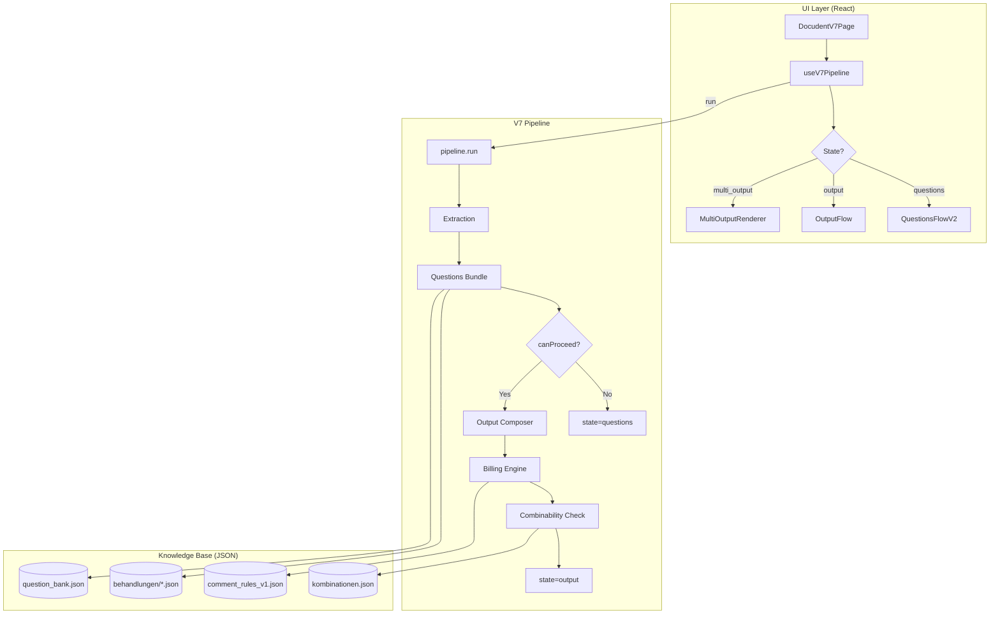

# ONBOARDING.md — Docudent V7

> **Git HEAD:** `910f189` | **Stand:** 2025-12-20  
> **Für:** Senior DB+LLM Engineer (Onboarding)  
> **Geschrieben von:** Architecture Scan @ dokumaster-ui

---

# Executive Summary

## Was ist Docudent V7?

Docudent ist ein **deterministisches Dokumentations-System für Zahnärzte**, das aus diktierten Behandlungsbeschreibungen automatisch:

1. **Strukturierten Freitext** für die Patientenakte generiert
2. **Abrechnungscodes** (BEMA/GOZ/BEL) mit rechtssicheren Referenzen auslöst  
3. **Kombinatorik-Prüfungen** durchführt (Regress-Schutz)
4. **Mehrbehandlungs-Szenarien** handhabt (2 Füllungen auf 2 Zähnen in einer Sitzung)

## Was ist done & proven?

| Was | Status | Beweis |
|-----|--------|--------|
| SSOT copyText-Invariante | ✅ Locked | 89 Gate-Tests enforced |
| Fragen-System V2 | ✅ Shipped | `QuestionsFlowV2.tsx` in Prod |
| Billing Scope aus DB | ✅ MF1 complete | `billingScopeResolver.ts` |
| Kombinatorik WARN/BLOCK | ✅ Live | `kombinationen.json` + UI-Banner |
| Multi-Instance Orchestrator | ✅ Done | 10 Tests für 2-Zähne-Szenario |
| E2E wired | ✅ 3 specs green | `v7/__e2e__/*.e2e.spec.ts` |

## Wo liegt der Hebel für DB+LLM?

| Bereich | Impact | Warum DB/LLM |
|---------|--------|--------------|
| **Scope Coverage erweitern** | 🔥 Hoch | 180 von ~900 Codes haben Scope. JSON → DB Migration ready. |
| **Kombinationen-Regeln vervollständigen** | 🔥 Hoch | 50 Regeln heute, KZV hat ~300. Structured data = DB-Job. |
| **Extraktion verbessern** | ⚡ Mittel | LLM Prompts für Zahn/Flächen/Diagnose. Precision messen. |
| **Answer Normalization** | ⚡ Mittel | Legacy IDs → Canonical. Translation table. |
| **Analog-Resolver** | 💡 Nice | Wenn kein Code passt → Analog-Empfehlung aus DB. |

---

# System Map

## Folder Structure

```
src/docudent/
├── contracts/               # SSOT Type Definitions ⭐
│   ├── pipeline.ts          # PipelineInput, PipelineResult
│   ├── questions.ts         # DynamicQuestion, QuestionBundle
│   ├── compose.ts           # ComposedDocumentV1, CombinabilityResult
│   └── output.ts            # ComposedOutput, ComposedSection
│
├── core/                    # Business Logic (NO UI)
│   ├── billing/
│   │   ├── knowledgeBase/
│   │   │   ├── logic/
│   │   │   │   ├── billingScopeResolver.ts   # ⭐ DB-backed scope
│   │   │   │   ├── outputComposer.ts         # SSOT compose
│   │   │   │   └── billingRegistry.ts        # Code lookup
│   │   │   └── rules/
│   │   │       └── comment_rules_v1.json     # 964 rules, 180 with scope
│   │   └── combinability/
│   │       └── billingCombinabilityChecker.ts
│   ├── playbooks/           # Treatment-specific logic
│   │   ├── fuellung/        # Filling pipeline
│   │   └── endo/            # Endo pipeline
│   └── extraction/          # LLM extraction normalization
│
├── v7/                      # Main UI + Pipeline ⭐
│   ├── pages/DocudentV7Page.tsx
│   ├── hooks/useV7Pipeline.ts
│   ├── pipeline/index.ts    # run() — Pure Orchestrator
│   ├── components/
│   │   ├── QuestionsFlowV2.tsx
│   │   ├── OutputFlow.tsx
│   │   └── MultiOutputRenderer.tsx
│   ├── multitreatment/
│   │   ├── orchestrator.ts  # ⭐ Multi-Instance execution
│   │   └── types.ts         # TreatmentInstance, MultiTreatmentResult
│   └── __e2e__/             # Playwright tests
│
├── v6/                      # LEGACY — do not extend
└── v8/                      # EXPERIMENTAL — not shipped
```

## Data Flow Diagram



---

# Core Flows

## 1️⃣ Single Treatment Flow

```
User Dictation → DocudentV7Page → useV7Pipeline.runPipeline()
  → pipeline/index.ts:run()
    → Extraction (Zahn, Flächen, Diagnose)
    → generateQuestionsV2Bundle() [question_bank.json]
    → IF required unanswered: return {state: 'questions', questionBundle}
    → ELSE: outputComposer.composeDocumentV1()
      → Blocks mit BillingRefs
      → copyText = blocks.map(b => b.text).join('\n\n')  ← SSOT INVARIANT
      → checkCombinability() [kombinationen.json]
    → return {state: 'output', output: ComposedOutput}
```

**SSOT Enforcement:** `contracts/compose.ts:81`
```typescript
// INVARIANT: copyText === blocks.map(b => b.text).join('\n\n')
```

**Key Files:**
- Entry: [`v7/pipeline/index.ts`](file:///Users/david/dokumaster-ui/src/docudent/v7/pipeline/index.ts)
- Compose: [`core/billing/knowledgeBase/logic/outputComposer.ts`](file:///Users/david/dokumaster-ui/src/docudent/core/billing/knowledgeBase/logic/outputComposer.ts)
- Questions: [`v7/components/QuestionsFlowV2.tsx`](file:///Users/david/dokumaster-ui/src/docudent/v7/components/QuestionsFlowV2.tsx)

---

## 2️⃣ Combinability Flow

```
Billing Codes Array → checkCombinability(codes, treatmentId, insuranceType)
  → Load kombinationen.json (50+ rules)
  → For each rule with type 'ausschluss':
    → Match codes against rule.betrifft[]
    → If match: create CombinabilityConflict
  → verdict = worst(conflicts.severity)
    → 'regress' → BLOCK
    → 'warnung' → WARN
    → else → PASS
  → Return CombinabilityResult {verdict, conflicts, requiredJustifications}
```

**UI Rendering:** `OutputFlow.tsx` renders banner based on `combinability.verdict`:
- PASS: No banner
- WARN: Yellow alert with conflict details
- BLOCK: Red alert, copy disabled

**Key Files:**
- Checker: [`core/billing/combinability/billingCombinabilityChecker.ts`](file:///Users/david/dokumaster-ui/src/docudent/core/billing/combinability/billingCombinabilityChecker.ts)
- Rules: [`core/billing/knowledgeBase/rules/kombinationen.json`](file:///Users/david/dokumaster-ui/src/docudent/core/billing/knowledgeBase/rules/kombinationen.json)
- Gate: [`__tests__/gates/gate-combinability-rules-lock.test.ts`](file:///Users/david/dokumaster-ui/src/docudent/v7/__tests__/gates/gate-combinability-rules-lock.test.ts)

---

## 3️⃣ MultiInstance / MultiTreatment Flow

```
Plan with Segment.instances[] → runMultiTreatment(plan)
  → FOR each segment:
    → IF segment.instances exists:
      → FOR each instance:
        → executeInstance(instance, segment, plan)
          → dictation = instance.dictationSlice || segment + tooth
          → answers = instance.answers  ← ISOLATED per tooth
          → result = pipeline.run({...})
          → extractBillingCodesWithScopeForInstance()
            → instanceId in each BillingCode
            → tooth forced from instance.tooth
        → Collect: perInstanceBundles[instanceId], perRunCopyText[]
    → ELSE: executeSegment() (legacy)
  → aggregatedCopyText = perRunCopyText.join('\n\n---\n\n')  ← DETERMINISTIC
  → aggregateBillingCodesWithScope():
    → TOOTH scope: keep duplicates if teeth differ
    → SESSION scope: dedupe to 1
  → checkCombinability(aggregatedCodes)
  → Return MultiTreatmentResult
```

**Scope Resolution (DB-backed):**
```typescript
// billingScopeResolver.ts
getBillingScopeWithFallback('BEMA_13c') // → 'TOOTH' (from comment_rules_v1.json)
getBillingScopeWithFallback('BEMA_40')  // → 'SESSION' (from fallback table)
```

**Normalization:** Zahn → TOOTH, Sitzung → SESSION, Kiefer → JAW, Behandlung → CASE

**Key Files:**
- Orchestrator: [`v7/multitreatment/orchestrator.ts`](file:///Users/david/dokumaster-ui/src/docudent/v7/multitreatment/orchestrator.ts)
- Types: [`v7/multitreatment/types.ts`](file:///Users/david/dokumaster-ui/src/docudent/v7/multitreatment/types.ts)
- Scope Resolver: [`core/billing/knowledgeBase/logic/billingScopeResolver.ts`](file:///Users/david/dokumaster-ui/src/docudent/core/billing/knowledgeBase/logic/billingScopeResolver.ts)
- Gate: [`__tests__/gates/gate-p14-multiinstance-2teeth.test.ts`](file:///Users/david/dokumaster-ui/src/docudent/__tests__/gates/gate-p14-multiinstance-2teeth.test.ts)

---

# SSOT + Contracts

## Key Types

| Type | Location | Purpose |
|------|----------|---------|
| `PipelineInput` | `contracts/pipeline.ts:16` | dictation, answers, insuranceType, treatmentId |
| `PipelineResult` | `contracts/pipeline.ts:39` | State machine: idle → questions → output |
| `QuestionBundle` | `contracts/questions.ts:77` | required + optionalVisible + optionalHidden |
| `ComposedDocumentV1` | `contracts/compose.ts:83` | copyText + blocks + billingRefs (SSOT) |
| `CombinabilityResult` | `contracts/compose.ts:127` | verdict + conflicts + justifications |
| `MultiTreatmentResult` | `v7/multitreatment/types.ts:169` | aggregatedCopyText + perInstanceBundles |
| `TreatmentInstance` | `v7/multitreatment/types.ts:25` | instanceId + tooth + answers |

## SSOT Invariants

```typescript
// contracts/compose.ts:81
interface ComposedDocumentV1 {
    copyText: string;   // INVARIANT: === blocks.map(b => b.text).join('\n\n')
    blocks: ComposedBlock[];
    billingRefs: BillingRef[];
}

// v7/multitreatment/orchestrator.ts:36
const MULTI_TREATMENT_SEPARATOR = '\n\n---\n\n';  // DETERMINISTIC, no timestamps
```

## Legacy vs SSOT

| Field | Status | Use |
|-------|--------|-----|
| `output.copyText` | ✅ SSOT | UI copies this |
| `output.fullText` | ⚠️ Legacy | Fallback only |
| `perTreatmentBundles` | ⚠️ Legacy | For segment-level |
| `perInstanceBundles` | ✅ SSOT | For instance-level |

---

# Billing Knowledge Base

## Data Sources

| File | Size | Purpose | Usage |
|------|------|---------|-------|
| `comment_rules_v1.json` | 3MB | 964 rules, 180 with `payload.scope` | Scope lookup, comment generation |
| `kombinationen.json` | 50KB | 50+ combinability rules | Regress prevention |
| `billing_codes_catalog.json` | 200KB | BEMA/GOZ/BEL catalog | Code description/price |
| `behandlungen/*.json` | varies | Per-treatment configs | Question triggers, output templates |

## Scope Data in comment_rules_v1.json

```json
{
  "ruleId": "CR_BEMA_xxx",
  "codePattern": "BEMA_13c",
  "payload": {
    "scope": "Zahn"   // → normalized to 'TOOTH'
  }
}
```

**Coverage:** 180 of ~900 codes have explicit scope. Rest use fallback table.

## Migration Path to Real DB

The JSON-based approach works but has limits. To move to DB:

1. **Schema:** `billing_rules(rule_id, code_pattern, scope, payload_json, evidence)`
2. **Loader:** Replace `loadScopeCache()` with SQL query
3. **Indexing:** Index on `code_pattern` for O(1) lookup
4. **Versioning:** Add `version` column, keep JSON as backup

**Effort:** ~2 days for scope table, ~1 week for full rules.

---

# Questions System (V2)

## QuestionBundle Structure

```typescript
interface QuestionBundle {
    required: DynamicQuestion[];      // HARD askbacks — always visible
    optionalVisible: DynamicQuestion[]; // SOFT — expanded
    optionalHidden: DynamicQuestion[];  // SOFT — collapsed
    optionalTotal: number;
    docMode: 'fast' | 'balanced' | 'forensic';
}
```

## ID Strategy

- **Canonical IDs:** `endo_step`, `filling_material`, `canal_count`
- **Legacy IDs:** `pos`, `neg`, `ja` → normalized via `answerTranslator.ts`
- **Prefix handling:** `fuellung_`, `endo_` prefixes for namespacing

## Progressive Disclosure

`QuestionsFlowV2.tsx` renders:
1. All `required` questions (no collapse)
2. Toggle for optional: "Optional (X)" expands `optionalHidden`
3. `onComplete()` called when all required answered

**canProceed Logic:**
```typescript
const canProceed = bundle.required.every(q => answers.has(q.id));
```

---

# Testing Strategy

## Test Pyramid

| Layer | Count | Location | Purpose |
|-------|-------|----------|---------|
| **Gate Tests** | 89 | `__tests__/gates/` | Lock invariants |
| **Unit Tests** | ~30 | `**/__tests__/` | Module logic |
| **E2E Tests** | 3 | `v7/__e2e__/` | Browser flows |

## Key Gates

| Gate | Invariant |
|------|-----------|
| `gate-p14-billing-scope-db` | Scope from DB, not hardcoded |
| `gate-p14-multiinstance-2teeth` | 2 teeth = 2x TOOTH, 1x SESSION |
| `gate-combinability-rules-lock` | kombinationen.json stable |
| `gate-no-patient-fields-in-output` | No PII in output |
| `gate-treatment-isolation` | No cross-treatment leakage |
| `gate-wiring-matrix` | All UI→pipeline paths wired |

## Determinism

- No timestamps in core types
- Same input → identical output (tested in `gate-p14-multiinstance-2teeth:determinism`)
- `MULTI_TREATMENT_SEPARATOR` is fixed string

## E2E Coverage

- `v7-flow.e2e.spec.ts` — Basic dictation → output
- `v7-ssot.e2e.spec.ts` — SSOT copy integrity
- `v7-realcases.e2e.spec.ts` — Real German dictations

---

# Hotspots / Leverage Areas

## Top 5 for DB Design

| Module | Why DB Matters | Current State |
|--------|----------------|---------------|
| `billingScopeResolver.ts` | 180/900 codes have scope | JSON, ready for migration |
| `kombinationen.json` | 50 rules, KZV has 300 | JSON, needs expansion |
| `comment_rules_v1.json` | 964 rules, searchable | JSON, 3MB load time |
| `behandlungen/*.json` | Per-treatment configs | JSON, versioned |
| `question_bank.json` | Question definitions | JSON, dedupe needed |

## Top 5 for LLM/Prompting

| Module | Why LLM Matters | Current State |
|--------|-----------------|---------------|
| `core/extraction/` | Zahn/Flächen/Diagnose aus Diktat | LLM-based, precision unknown |
| `playbooks/*/signalParser.ts` | Treatment-specific signals | Regex + keyword, could be LLM |
| `analogResolver.ts` | "Keine Entsprechung" → Analog | Matching algo, could use embeddings |
| Answer normalization | Legacy → Canonical | Rule-based, could be semantic |
| Kombinationen expansion | Generate rules from KZV docs | Manual today, LLM feasible |

## Sharp Edges (easy to break)

1. **Don't mutate answers Map mid-pipeline** — Gates catch this
2. **Don't add timestamps to core types** — SSOT invariant fails
3. **Don't skip scope lookup** — Billing aggregation breaks
4. **Don't change separator** — E2E assertions fail
5. **Don't mix instanceId/segmentId** — Isolation breaks

## Suggested Improvements (ROI)

| Improvement | Effort | Impact | ROI |
|-------------|--------|--------|-----|
| Scope coverage → 500 codes | S (2d) | High | 🔥 |
| kombinationen → 150 rules | M (1w) | High | 🔥 |
| Extraction precision metrics | S (1d) | Medium | ⚡ |
| JSON → SQLite for rules | M (1w) | Medium | ⚡ |
| LLM analog matching | L (2w) | Low | 💡 |

---

# First Week Plan

## Day 1: Run Tests + Mental Model

```bash
# Clone & install
git clone ... && cd dokumaster-ui && npm install

# Run all gates (should be green)
npm test -- --run src/docudent/__tests__/gates/

# Run E2E (needs dev server)
npm run dev &
DOCUDENT_TEST_MODE=stub_extraction npx playwright test src/docudent/v7/__e2e__/

# Read this doc + ARCHITECTURE_OVERVIEW_V7.md
```

**Goal:** Understand state machine (idle → questions → output) and SSOT invariant.

## Day 2-3: DB/Rules Deep Dive

1. Open `comment_rules_v1.json` — understand rule structure
2. Trace `billingScopeResolver.ts` — how scope is loaded and cached
3. Open `kombinationen.json` — understand conflict structure
4. Propose: "If this were Postgres, schema would be..."
5. Write 3 new rules to `kombinationen.json` and run gate

## Day 4-5: Implement One Improvement

**Suggested:** Expand scope coverage from 180 → 300 codes

1. Find codes without scope in `comment_rules_v1.json`
2. Look up scope in KZV documentation (Zahn/Sitzung)
3. Add `payload.scope` to 120 rules
4. Run `gate-p14-billing-scope-db` — should show higher coverage
5. PR with new coverage metrics

---

# Glossary

| Term | Definition |
|------|------------|
| **SSOT** | Single Source of Truth — copyText derived from blocks only |
| **Bundle** | QuestionBundle — required + optional questions |
| **Chips** | Activated question options (legacy V6 term) |
| **Composer** | outputComposer.ts — assembles blocks into document |
| **Gates** | Invariant-locking tests that fail loudly |
| **Combinability** | WARN/BLOCK for forbidden code combinations |
| **Scope** | TOOTH/SESSION/JAW/CASE — determines dedupe behavior |
| **Instance** | One execution of a treatment on one tooth |
| **Segment** | A portion of dictation mapped to one treatment |

---

> **Welcome to the team. This codebase is real, tested, and ready for your DB+LLM expertise.**
