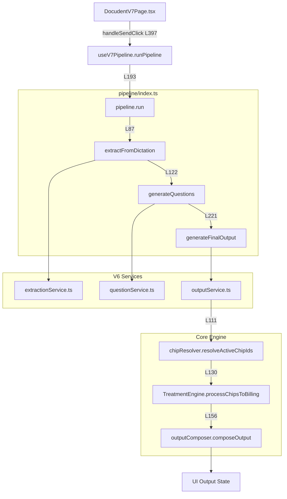
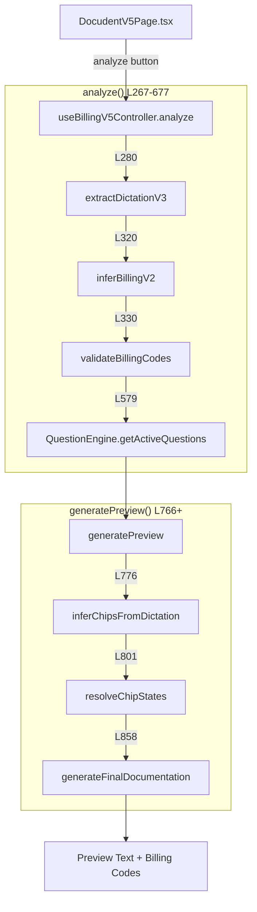

# Dokumaster-UI Architecture

> Auto-generated reference documentation. Every claim includes file:line evidence.

---

## Route Map

| Route | Component | File | Evidence |
|-------|-----------|------|----------|
| `/` | Login | `src/App.jsx` | L129 |
| `/home` | HomePage | `src/pages/HomePage.tsx` | L130 |
| `/docudent` | DocudentV5 | `src/docudent/v5/pages/DocudentV5Page.tsx` | L133 |
| `/docudent/v5` | DocudentV5 | `src/docudent/v5/pages/DocudentV5Page.tsx` | L134 |
| `/docudent/v6` | DocudentV6 | `src/docudent/v6/pages/DocudentV6Page.tsx` | L137 |
| `/docudent/v7` | DocudentV7 | `src/docudent/v7/pages/DocudentV7Page.tsx` | L140 |

**Entry Point:** `src/main.jsx` L13-23  
**Providers:** BrowserRouter, AuthProvider, UserProvider

---

## V7 Pipeline Flow



**Key Files:**
- `src/docudent/v7/pipeline/index.ts` L53-278 — Orchestrator
- `src/docudent/v6/services/outputService.ts` L89-256 — Passthrough
- `src/docudent/core/billing/knowledgeBase/logic/treatmentEngine.ts` L284-455 — Chip→Billing

---

## V5 Pipeline Flow



**Key Files:**
- `src/docudent/v5/hooks/useBillingV5Controller.ts` L188-1116 — Controller
- `src/docudent/core/billing/knowledgeBase/logic/billingRegistry.ts` — inferBillingV2
- `src/docudent/core/billing/knowledgeBase/logic/treatmentEngine.ts` L812 — generateFinalDocumentation

---

## Where Billing Happens

| Step | Function | File | Line |
|------|----------|------|------|
| Chip→Code mapping | `processChipsToBilling()` | `treatmentEngine.ts` | L284-455 |
| Billing inference | `inferBillingV2()` | `billingRegistry.ts` | L172+ |
| Code validation | `validateBillingCodes()` | `billingValidation.ts` | exported |
| Combination rules | `checkCombinationConflicts()` | `treatmentEngine.ts` | L249-278 |
| Output assembly | `composeOutput()` | `outputComposer.ts` | exported |

---

## Where Persistence Happens

| Collection | Operation | File | Line |
|------------|-----------|------|------|
| `Praxen/1/Vorlagen` | read/write | `src/_legacy/Settings.jsx` | L130,L244 |
| `Praxen/1/Notes` | write | `src/utils/noteService.ts` | L39 |
| `Praxen/1/Bausteine` | read/write | `src/components/BausteinVerwaltung.jsx` | L14,L35 |

> **Note:** V7 does NOT write to Firestore. It is a pure client-side renderer.

---

## Mehrkosten Output (GKV + GOZ Split)

**Scope:** Chairside documentation only (HKP planning is separate)

| Component | File | Function |
|-----------|------|----------|
| Policy configuration | `mehrkostenPolicy.ts` | `getDefaultMehrkostenPolicy()` |
| Calculation | `mehrkostenPolicy.ts` | `calculateMehrkosten()` |
| Output rendering | `outputComposer.ts` | `renderAbrechnung()` |
| Amount lookup | `outputService.ts` | billingDetails from catalog |
| MKV disclosure | `disclosures.json` | `mkv_hinweis` |

**Configurable Policy:**
- **Endo:** Per-canal pricing (e.g., 100€ × canals)
- **Add-ons:** Microscope (+50€), NiTi (+30€), Irrigation protocol (+20€)
- **Filling:** Fixed or percentage-based MKV amount

**Label Modes:**
- **Filling with MKV:** Shows "Mehrkostenvereinbarung vor Behandlung vereinbart." — `labelMode: 'mkv'`
- **Endo with GOZ-Zusatz:** Shows "Zusatzleistung (GOZ)" — `labelMode: 'zusatzleistung'` — NO MKV wording

**Example Output (Endo 3 canals + microscope):**
```
Zusatzleistung (Mehrkosten):
  Wurzelkanalbehandlung (3 Kanäle)  300,00€
  OP-Mikroskop                       50,00€
  Patientenanteil: 350,00€
```

**Gate Tests:**
- `gate-mehrkosten-policy.test.ts` ✓

---

## BEL2 Runtime Wiring

**Scope:** ZE/lab labor positions (crowns, bridges, prosthetics)

| Component | File | Function |
|-----------|------|----------|
| BEL2 catalog lookup | `bel2Catalog.ts` | `lookupBel2()` |
| Catalog-driven resolution | `bel2Catalog.ts` | `resolveBel2CodeFromRaw()` |
| HKP labor enrichment | `hkpGenerator.ts` | `generiereHKPKrone()` |
| Placeholder inventory | `scripts/audit_bel2_placeholders.ts` | `generateBel2PlaceholderReport()` |

**Behavior:**
- NO invented BEL codes — only catalog-validated codes are used
- Ambiguous/short codes (e.g., "001") return warnings, original retained
- Crown labor positions use `BEL_1021` (Vollkrone/Metall)

**Gate Tests:**
- `gate-bel2-catalog-ssot.test.ts`
- `gate-bel2-runtime-wiring.test.ts`
- `gate-bel2-placeholder-inventory.test.ts`

---

## Endo Step Detection

**Scope:** Automatically detect or ask for the endodontic treatment phase (start/interim/complete)

| Component | File | Function/ID |
|-----------|------|-------------|
| Detection logic | `endoStepDetector.ts` | `detectEndoStep()` |
| Askback question | `endo/question_bank.json` | `endo_step` |
| Output section | `outputComposer.ts` | `endo_schritt` |
| Section injection | `outputService.ts` | L164-172 |

**Detection Keywords:**
- `endo_complete`: "guttapercha", "wurzelfüllung", "wf", "abschluss"
- `endo_interim`: "einlage erneuert", "zwischensitzung"
- `endo_start`: "trepanation", "eröffnung", "einlage" (without "erneuert")

**Behavior:**
- If keywords detected → auto-populate `extracted.mentioned.endo_step`
- If ambiguous (no match) → add `endo_step` question to askback list
- `endo_schritt` section injected at top of `output.sections[]`

**Output Contract:**
- UI copy/export uses `output.sections.map(s => s.label + s.content)` — NOT fullText
- `endo_schritt` injection affects clipboard because it is in `sections[]`

**Gate Tests:**
- `gate-endo-step-v7.test.ts` ✓
- `gate-mvp-v7-golden-dictations.test.ts` ✓

---

## Frontend Gates (Playwright E2E)

**Scope:** Real browser testing for V7 UI wiring

| Test File | Purpose |
|-----------|---------|
| `e2e/smoke.spec.ts` | V7 stability, auth bypass verification, basic UI wiring |
| `e2e/v7-ui-wiring.spec.ts` | Complete flow: Dictation → Questions → Answer → Output → Copy |

**Run:**
```bash
npm run test:e2e           # All E2E tests
npm run test:e2e:v7        # V7 UI wiring only
```

**Auth Bypass (E2E Mode):**
The tests use `VITE_E2E_TEST_MODE=true` to bypass Firebase auth:

| Component | File | Behavior |
|-----------|------|----------|
| Auth bypass | `AuthContext.jsx` | `isE2EMode` skips Firebase redirect when `DEV && VITE_E2E_TEST_MODE` |
| Mock user | `AuthContext.jsx` | E2E mode creates mock user `{ uid: 'e2e-test-user' }` |
| Stub extraction | `pipeline/index.ts` | `VITE_STUB_EXTRACTION=true` uses offline stub extractor |

**Safety Guarantees:**
- Auth bypass **ONLY** works when `import.meta.env.DEV === true` AND `VITE_E2E_TEST_MODE === 'true'`
- Production builds cannot enable the bypass (DEV is false)
- Stub extraction is browser-compatible via `import.meta.env`

**Current Test Coverage:**
- ✓ Page loads without auth redirect
- ✓ Insurance toggle functional
- ✓ Dictation input works
- ✓ Pipeline triggers on Ctrl+Enter
- ✓ Questions step displays correctly
- ✓ Full flow: Dictation → Questions → Output
- ✓ Copy button functional
- ✓ No `[object Object]` rendering

---

## Open Questions

1. **Where does V7 trigger note saving?** — noteService export exists but caller not traced.

