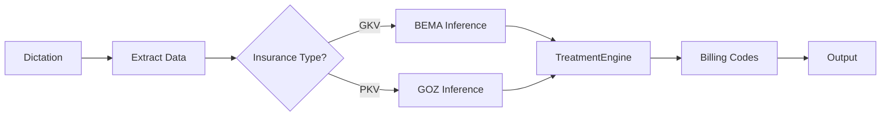
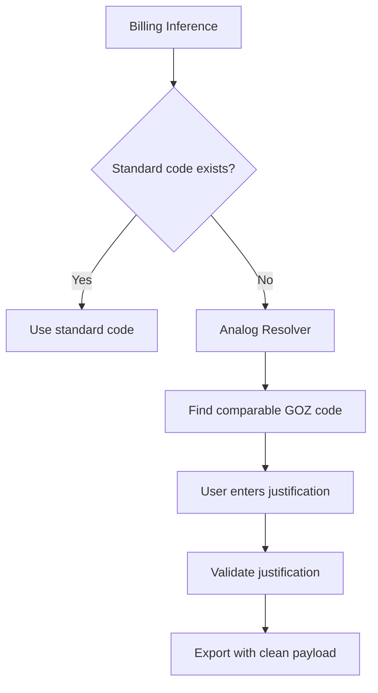
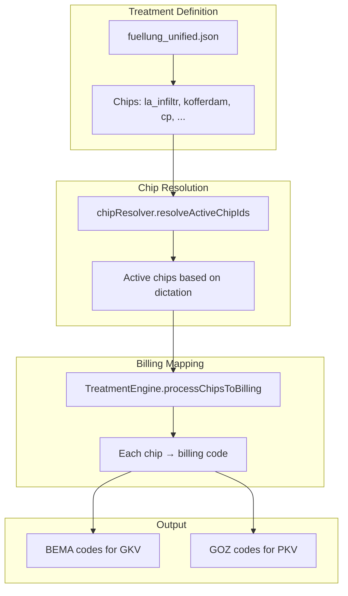

# Billing Logic

> How BEMA, GOZ, and Analog billing interact in Docudent.

---

## Billing System Overview

German dental billing uses two main systems:

| System | Full Name | Insurance Type | Example |
|--------|-----------|----------------|---------|
| **BEMA** | Bewertungsmaßstab | GKV (statutory) | `BEMA 13a` |
| **GOZ** | Gebührenordnung für Zahnärzte | PKV (private) | `GOZ 2060` |
| **GOÄ** | Gebührenordnung für Ärzte | Medical procedures | `GOÄ 440` |
| **Analog** | Analogleistungen | Non-catalogued procedures | `GOZ-A` |

---

## Where Billing Happens



### Key Files

| Step | File | Line |
|------|------|------|
| Billing dispatch | `billingRegistry.ts` | `inferBillingV2()` |
| Chip → Code mapping | `treatmentEngine.ts` | `processChipsToBilling()` L284-455 |
| Code lookup | `treatmentEngine.ts` | `lookupBillingCode()` L180-233 |
| Validation | `billingValidation.ts` | `validateBillingCodes()` |
| Combination check | `crossValidator.ts` | `validateCodes()` |

---

## BEMA Billing

**Source:** `kataloge/bema.json`

```json
{
  "BEMA_13a": {
    "code": "13a",
    "beschreibung": "Kompositfüllung, einflächig",
    "punkte": 42,
    "kategorie": "Konservierend"
  }
}
```

**Calculation:** `punkte × Punktwert (1.0375 for 2025)`

---

## GOZ Billing

**Source:** `kataloge/goz.json`

```json
{
  "GOZ_2060": {
    "code": "2060",
    "beschreibung": "Präparieren einer Kavität",
    "betrag_1fach": 14.46,
    "betrag_23": 33.26,
    "kategorie": "Konservierende Leistungen"
  }
}
```

**Multipliers:** 1.0x (min), 2.3x (standard), 3.5x (max)

---

## Analog Billing (GOZ-A)

When no standard code applies, an "Analogleistung" is used:

```
Dictation: "Zahn 36, mod, Caries profunda, Pulpanah, MTA-Überkappung"
                                                    ↑
                                          No standard code!
                                                    ↓
                              Analog: GOZ-A 2330 (vergleichbar mit GOZ 2330)
```

### Analog Flow in V5



**Key Files:**
- `analogResolver.ts` — Finds comparable codes
- `analogJustificationService.ts` — Manages justification text
- `analogCompletionValidator.ts` — Validates completeness
- `analogExportGuard.ts` — Prevents commentary leaks

---

## Combination Rules

Some codes cannot be billed together:

```json
{
  "kombinationen": [
    {
      "code1": "BEMA_13a",
      "code2": "BEMA_13b",
      "erlaubt": false,
      "grund": "Nur eine Füllung pro Zahn/Fläche"
    }
  ]
}
```

**Source:** `regeln/kombinationen.json`

---

## Billing Validation

| Check | File | Risk Level |
|-------|------|------------|
| Combination conflicts | `crossValidator.ts` | **Regress** |
| Frequency limits | `billingValidation.ts` | Warning |
| Missing documentation | `billingValidation.ts` | Info |

---

## Treatment → Billing Flow



---

## Catalog Files

| Catalog | Path | Count |
|---------|------|-------|
| BEMA | `kataloge/bema.json` | ~200 codes |
| GOZ | `kataloge/goz.json` | ~400 codes |
| GOÄ | `kataloge/goae.json` | ~50 codes |
| Festzuschuss | `kataloge/festzuschuss.json` | ~50 entries |
