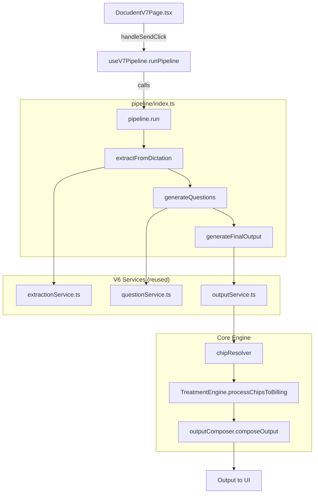
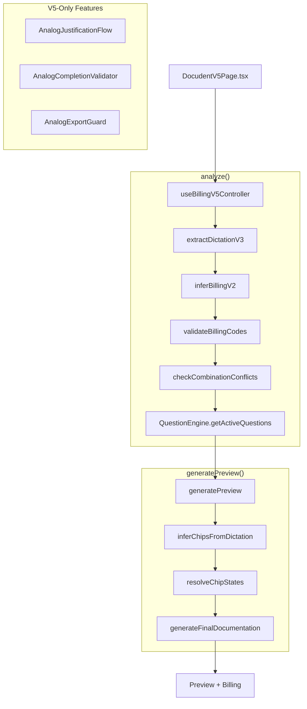
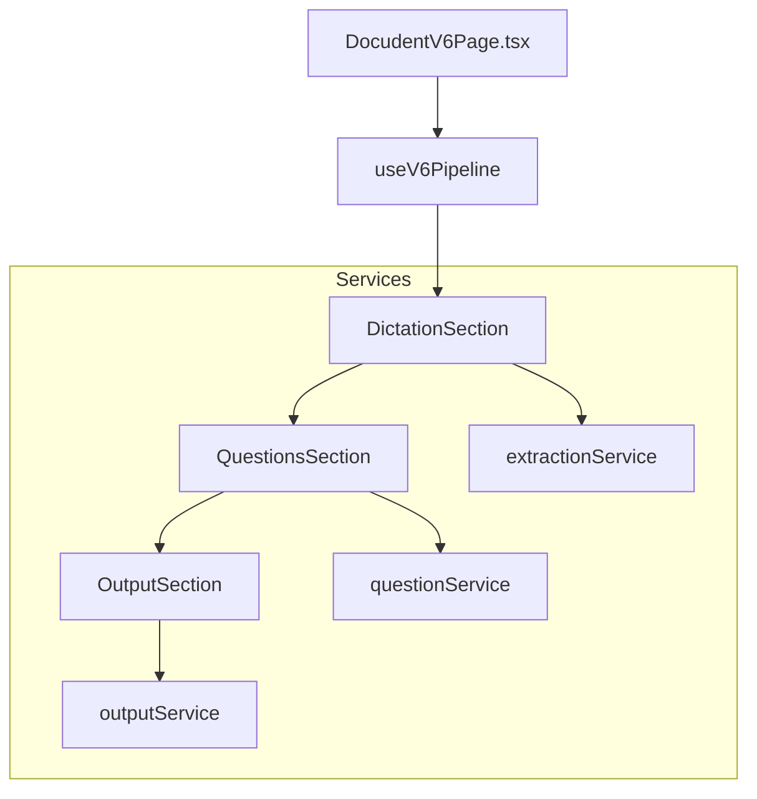

# Docudent Pipelines

> V5, V6, and V7 pipeline documentation with flowcharts.

---

## Pipeline Overview

| Version | Status | Entry Point | Use Case |
|---------|--------|-------------|----------|
| **V5** | Production | `useBillingV5Controller.ts` | Full-featured, 4-step wizard with analog justifications |
| **V6** | Stable | `useV6Pipeline.ts` | Simplified 3-section flow |
| **V7** | Active Development | `pipeline/index.ts` | Pure UI renderer, multi-treatment support |

---

## When to Use Which

| Scenario | Recommended Pipeline |
|----------|---------------------|
| Standard filling documentation | V5 or V7 |
| Complex analog billing | V5 (has justification UI) |
| Multi-treatment cases | V7 (has segment editor) |
| Simple dictation → output | V6 |

---

## V7 Pipeline (Recommended)

**Architecture:** Pure UI renderer + Backend orchestrator

**Key Files:**
- `src/docudent/v7/pages/DocudentV7Page.tsx` — Pure UI (no logic)
- `src/docudent/v7/hooks/useV7Pipeline.ts` — State container
- `src/docudent/v7/pipeline/index.ts` — Orchestrator
- `src/docudent/v7/multitreatment/index.ts` — Multi-treatment support

---

## V5 Pipeline (Full-Featured)

**Architecture:** Integrated controller with 4-step wizard

**V5-Only Features:**
- Analog justification UI flow
- Tiered question engine (3 levels)
- Cross-validator with regress warnings
- Chip toggle UI
- Treatment setup wizard

---

## V6 Pipeline (Simple)

**Architecture:** 3-section flow (Dictation → Questions → Output)

**Notes:**
- Simpler than V5 (no analog justifications)
- V7 reuses V6 services

---

## Shared Core Modules

All pipelines use these core modules:

| Module | File | Purpose |
|--------|------|---------|
| TreatmentEngine | `treatmentEngine.ts` | Chip → billing code mapping |
| ChipResolver | `chipResolver.ts` | Active chip resolution |
| OutputComposer | `outputComposer.ts` | Template-driven text rendering |
| BillingRegistry | `billingRegistry.ts` | Treatment-specific billing dispatch |

---

## Pipeline Comparison

| Feature | V5 | V6 | V7 |
|---------|:--:|:--:|:--:|
| Extraction | ✅ | ✅ | ✅ |
| Billing Inference | ✅ | ✅ | ✅ |
| Question Generation | ✅ (tiered) | ✅ | ✅ |
| Output Composition | ✅ | ✅ | ✅ |
| Analog Justification | ✅ | ❌ | ❌ |
| Cross-Validation | ✅ | ❌ | ❌ |
| Multi-Treatment | ❌ | ❌ | ✅ |
| Pure UI Architecture | ❌ | ❌ | ✅ |
