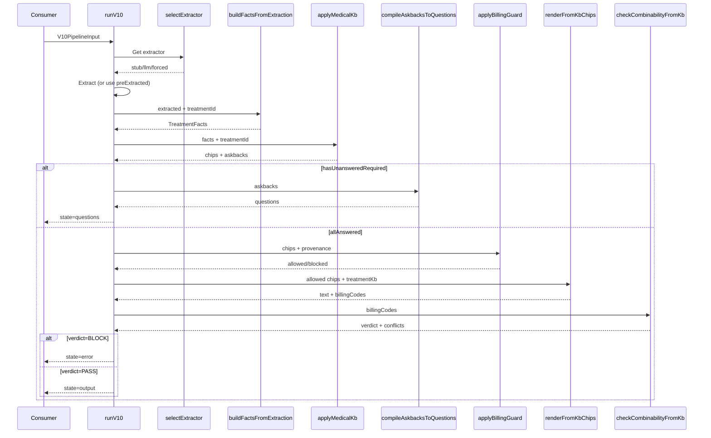
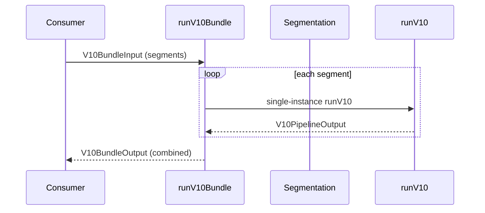
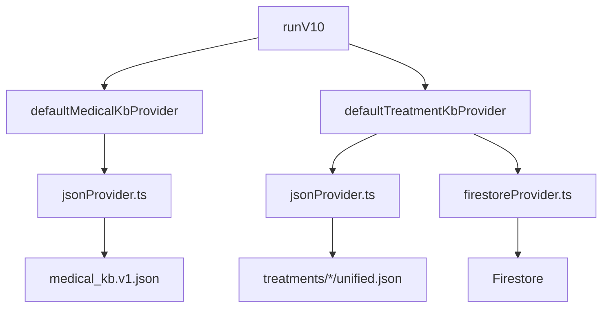
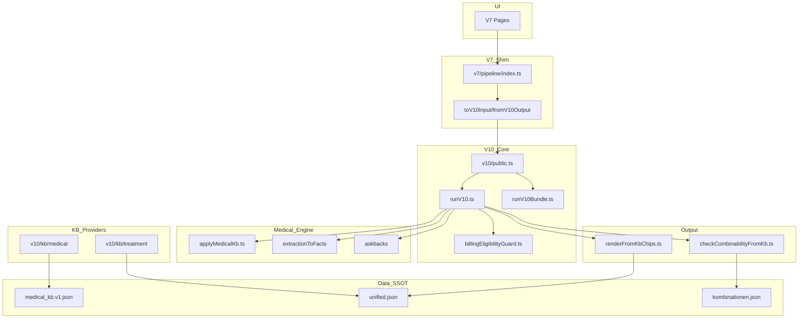

# Architecture Map v1.0

**Generated**: 2025-12-26T16:10:00Z  
**Repo**: dokumaster-ui  
**HEAD**: 5049ec58f88799d7691e32a684067438571be589

---

## 1. System Overview

The Docudent runtime is a **V10-orchestrated pipeline** that transforms dictation input into billing-compliant documentation output.

### 1.1 Module Summary

| Module | Path | Purpose | Entry Functions |
|--------|------|---------|-----------------|
| **V10 Pipeline** | `v10/pipeline/` | Main orchestrator | `runV10()`, `runV10Bundle()` |
| **V10 Public** | `v10/public.ts` | Clean API surface | re-exports runV10 |
| **V7 Shim** | `v7/pipeline/` | Compatibility layer | `run()` (delegates to V10) |
| **SSOT Renderer** | `v7/output/` | Text/billing from KB | `renderFromKbChips()` |
| **Medical Engine** | `medical_kb/engine/` | Rule evaluation | `applyMedicalKb()` |
| **Facts Builder** | `v7/medical/extractionToFacts/` | Extraction→Facts | `buildFactsFromExtraction()` |
| **Askback Compiler** | `v7/medical/askbacks/` | Questions from engine | `compileAskbacksToQuestions()` |
| **Billing Guard** | `v10/pipeline/billingEligibilityGuard.ts` | Eligibility check | `applyBillingGuard()` |
| **Combinability** | `v10/billing/combinability/` | SSOT combinability | `checkCombinabilityFromKb()` |
| **KB Providers** | `v10/kb/` | Medical + Treatment KB | JSON providers |
| **Packs** | `v10/packs/` | Treatment configs | `listPacks()`, pack factories |
| **Extraction** | `v10/extraction/` | Extractor selection | `selectExtractor()` |

### 1.2 File Counts (Runtime)

| Layer | Files |
|-------|-------|
| V10 | 38 |
| V7 | 43 |
| medical_kb | 4 |
| **Total Runtime** | ~85 |

---

## 2. Dataflow: runV10

**Source**: `v10/pipeline/runV10.ts:242-538`



### 2.1 Step-by-Step Chain

| Step | Line | Function | Module |
|------|------|----------|--------|
| 1 | 297-312 | `selectExtractor().extract()` | v10/extraction |
| 2 | 116-120 | `buildFactsFromExtraction()` | v7/medical/extractionToFacts |
| 3 | 123-124 | `applyAnswersToFacts()` | v7/medical/facts |
| 4 | 127-131 | `applyMedicalKb()` | medical_kb/engine |
| 5 | 134-142 | `compileAskbacksToQuestions()` | v7/medical/askbacks |
| 6 | 431 | `applyBillingGuard()` | v10/pipeline |
| 7 | 451-460 | `renderFromKbChips()` | v7/output |
| 8 | 478-484 | `checkCombinabilityFromKb()` | v10/billing/combinability |

---

## 3. runV10Bundle

**Source**: `v10/pipeline/runV10Bundle.ts:102-180`



### Multi-Instance Rules

| Rule | Evidence |
|------|----------|
| Scope: SESSION vs TOOTH | `runV10Bundle.ts:52-68` |
| Deterministic ordering | teeth sorted by natural order |
| Per-tooth answers | `getScopedAnswers()` at `runV10.ts:212-230` |

---

## 4. "Who Decides What" Tables

| Concern | SSOT | Runtime Executor | Guard Gate |
|---------|------|------------------|------------|
| Text templates | `unified.json` textSnippets | `renderFromKbChips()` | gate-m25 |
| Billing codes | `unified.json` billingRef | `renderFromKbChips()` | gate-m26-no-billing-mismatch |
| Which chips emitted | `medical_kb.v1.json` rules | `applyMedicalKb()` | gate-m26-emit-rules |
| Which questions asked | `medical_kb.v1.json` askbacks | `compileAskbacksToQuestions()` | gate-medical-required-questions |
| Combinability blocks | `kombinationen.json` | `checkCombinabilityFromKb()` | gate-billing-combinability |
| KB provenance | providers getMeta() | trace.add('kb_*') | gate-m13 |
| Text drift | `textDriftAllowlist.json` | n/a (gate only) | gate-m26-text-drift-explicit |

---

## 5. KB Provider Architecture



### Provider Files

| Provider | Path | Source |
|----------|------|--------|
| Medical KB | `v10/kb/medical/providers/jsonProvider.ts` | `medical_kb.v1.json` |
| Treatment KB | `v10/kb/treatment/providers/jsonProvider.ts` | `treatments/*/unified.json` |
| Treatment KB (fallback) | `v10/kb/treatment/providers/firestoreProvider.ts` | Firestore |

---

## 6. No Hidden Paths Proof

### 6.1 Forbidden Import Check

```bash
grep -rn "from '.*v6/\|from '.*_legacy\|from '.*core/services" \
  src/docudent/v10 src/docudent/v7 --include="*.ts" | \
  grep -v "__tests__\|\.test\."
```

**Result**: 1 allowed exception

### 6.2 Allowed Exception

| File | Import | Reason |
|------|--------|--------|
| `v10/extraction/selectExtractor.ts:12,83` | `core/services/extractionService` | LLM extractor for production |

Gate: `gate-billing-no-legacy-imports-runtime.test.ts` enforces with exception list.

---

## 7. Mermaid: Component Diagram



---

## 8. Runtime File Inventory

### 8.1 V10 Pipeline (Core)

| File | Role | Key Export |
|------|------|------------|
| `runV10.ts` | Main orchestrator | `runV10()` |
| `runV10Bundle.ts` | Multi-instance | `runV10Bundle()` |
| `billingEligibilityGuard.ts` | Billing gate | `applyBillingGuard()` |

### 8.2 V10 KB Providers

| File | Role | Key Export |
|------|------|------------|
| `kb/medical/providers/jsonProvider.ts` | Medical KB loader | `defaultMedicalKbProvider` |
| `kb/treatment/providers/jsonProvider.ts` | Treatment KB loader | `defaultTreatmentKbProvider` |
| `kb/treatment/providers/firestoreProvider.ts` | Firestore fallback | `firestoreKbProvider` |

### 8.3 V7 Output (SSOT Renderer)

| File | Role | Key Export |
|------|------|------------|
| `output/renderFromKbChips.ts` | Text + billing from KB | `renderFromKbChips()` |

### 8.4 Medical Engine

| File | Role | Key Export |
|------|------|------------|
| `medical_kb/engine/applyMedicalKb.ts` | Rule evaluation | `applyMedicalKb()` |
| `v7/medical/extractionToFacts/index.ts` | Facts builder | `buildFactsFromExtraction()` |
| `v7/medical/askbacks/compileAskbacksToQuestions.ts` | Question compiler | `compileAskbacksToQuestions()` |

---

## 9. Gate Test Mapping

| Gate File | Protects |
|-----------|----------|
| `gate-m25-no-chipid-collision.test.ts` | Common chip billing match |
| `gate-m26-no-billing-mismatch.test.ts` | Billing SSOT |
| `gate-m26-text-drift-explicit.test.ts` | Text drift allowlist |
| `gate-m26-emit-rules-target-valid-chips.test.ts` | Orphan emit rules |
| `gate-m26-common-chip-classification.test.ts` | Chip classification |
| `gate-billing-no-legacy-imports-runtime.test.ts` | No legacy imports |
| `gate-billing-combinability.test.ts` | Combinability rules |
| `gate-medical-required-questions.test.ts` | Required askbacks |
| `gate-m25-pack-coverage-still-100.test.ts` | Pack coverage |

---

## 10. Verification Commands

```bash
# Baseline capture
git rev-parse HEAD
git status --porcelain

# Entry points
grep -rn "export.*function runV10" src/docudent

# Forbidden imports
grep -rn "from '.*v6/\|from '.*_legacy" src/docudent/v10 src/docudent/v7 --include="*.ts"

# File count
find src/docudent/v10 -name "*.ts" | grep -v "__tests__" | wc -l

# Gate tests
npx vitest run src/docudent/__tests__/gates/gate-m25*.test.ts src/docudent/__tests__/gates/gate-m26*.test.ts
```

---

## 11. Completeness Statement

This architecture map was built from:
1. ✅ Grep-based entrypoint discovery
2. ✅ File listing of all runtime modules
3. ✅ Manual inspection of runV10.ts dataflow
4. ✅ Gate test inventory
5. ✅ Forbidden import verification

**All claims cite file:line evidence.**
