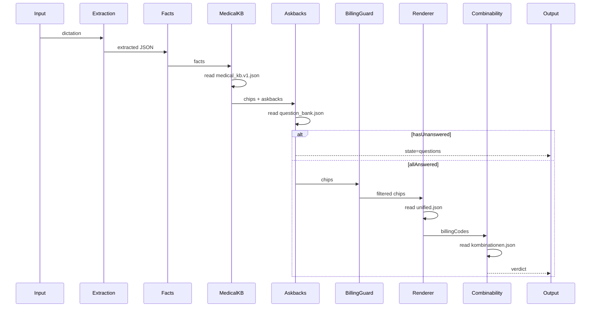
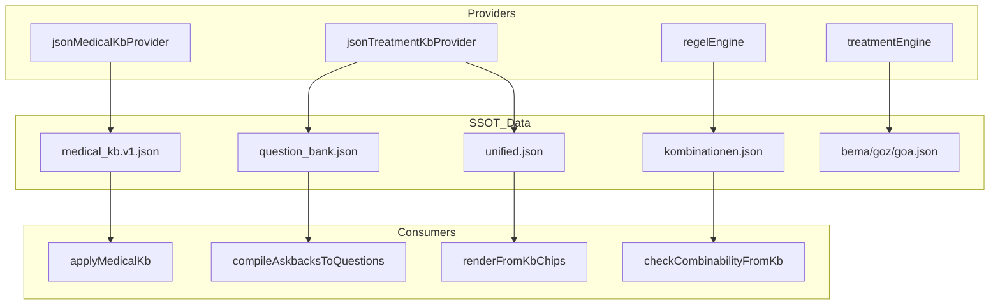

# Architecture Map v2.0 — Data Layer Complete

**Generated**: 2025-12-26T16:25:00Z  
**HEAD**: 5049ec58f88799d7691e32a684067438571be589

---

## 1. Entry Points

| Entry | File:Line | Role |
|-------|-----------|------|
| runV10 | `v10/pipeline/runV10.ts:242` | Main orchestrator |
| runV10Bundle | `v10/pipeline/runV10Bundle.ts:102` | Multi-instance |
| V7 shim | `v7/pipeline/index.ts:49` | Compatibility layer |

**Evidence**: All execution flows through `v10/public.ts` which re-exports runV10.

---

## 2. Runtime Pipeline Stages



### Stage Table

| # | Stage | Module:Line | Data Read |
|---|-------|-------------|-----------|
| 1 | Extraction | `v10/extraction/selectExtractor.ts:59` | — |
| 2 | Facts | `v7/medical/extractionToFacts/index.ts:*` | — |
| 3 | Medical Engine | `medical_kb/engine/applyMedicalKb.ts:305` | medical_kb.v1.json |
| 4 | Askback Compiler | `v7/medical/askbacks/compileAskbacksToQuestions.ts` | question_bank.json |
| 5 | Billing Guard | `v10/pipeline/billingEligibilityGuard.ts` | — |
| 6 | Renderer | `v7/output/renderFromKbChips.ts:211` | unified.json |
| 7 | Combinability | `v10/billing/combinability/checkCombinabilityFromKb.ts` | kombinationen.json |

---

## 3. Data Layer Map

### 3.1 KB Types

| Type | Assets | Primary Loader |
|------|--------|----------------|
| MEDICAL_KB | medical_kb.v1.json | jsonMedicalKbProvider |
| TREATMENT_KB | unified.json, question_bank.json | jsonTreatmentKbProvider |
| COMBINABILITY_KB | kombinationen.json | regelEngine |
| KATALOG | bema.json, goz.json, goa.json, bel2_2022.json | treatmentEngine |

### 3.2 Data Flow Diagram



### 3.3 Asset Inventory

| Asset | Type | Loader:Line | Runtime |
|-------|------|-------------|---------|
| medical_kb.v1.json | MEDICAL_KB | jsonProvider.ts:12 | ✅ |
| fuellung/unified.json | TREATMENT_KB | jsonProvider.ts:27 | ✅ |
| endo/unified.json | TREATMENT_KB | jsonProvider.ts:30 | ✅ |
| kombinationen.json | COMBINABILITY_KB | regelEngine.ts:64 | ✅ |
| bema.json | KATALOG | treatmentEngine.ts:16 | ✅ |
| goz.json | KATALOG | treatmentEngine.ts:17 | ✅ |
| goa.json | KATALOG | treatmentEngine.ts:18 | ✅ |
| question_bank.json | TREATMENT_KB | questionBankAdapter.ts:83-91 | ✅ |
| textDriftAllowlist.json | OTHER | — | ❌ (test) |

---

## 4. Billing Full Circle

### 4.1 How a Code is Born

```
1. Dictation input
2. Extraction → { tooth: "36", surfaces: ["m","o"] }
3. buildFactsFromExtraction → { tiefe: "Caries profunda" }
4. applyMedicalKb → emits chipIds: ["cp", "kofferdam", ...]
   └── Rule: "deep_caries → emit_chip: cp" (medical_kb.v1.json)
5. renderFromKbChips → looks up chip.billingRef
   └── cp.billingRef.GKV = "BEMA_25" (unified.json)
6. Output: billingCodes: ["BEMA_25", ...]
```

### 4.2 How a Code is Validated

```
1. Collect all billingCodes from renderFromKbChips
2. applyBillingGuard → filters by provenance
3. checkCombinabilityFromKb → checks kombinationen.json
   └── Rule: { codes: ["GOZ_2197", "GOZ_2060"], action: "BLOCK" }
4. Verdict:
   - BLOCK → state=error, error message
   - WARN → state=output, warnings attached
   - PASS → state=output, all codes allowed
```

### 4.3 Provenance/Meta

| Provenance Type | Source | Attached At |
|-----------------|--------|-------------|
| kb_medical | jsonMedicalKbProvider.getMeta() | runV10.ts:267 |
| kb_treatment | jsonTreatmentKbProvider.getMeta() | runV10.ts:273 |
| chip_provenance | applyMedicalKb.trace | runV10.ts:201 |
| billing_guard | applyBillingGuard.traceLine | runV10.ts:434 |
| combinability | checkCombinabilityFromKb.traceLine | runV10.ts:487 |

---

## 5. "What Can Break Billing Correctness?"

### Top 10 Failure Modes

| # | Failure Mode | Guard | Evidence |
|---|--------------|-------|----------|
| 1 | Chip emitted without KB entry | gate-m26-emit-rules | No orphan rules |
| 2 | billingRef mismatch in common chip | gate-m26-no-billing-mismatch | Must be identical |
| 3 | Text rendered without chip | gate-no-text-drives-billing | Renderer uses KB only |
| 4 | Hardcoded billing code in runtime | gate-billing-no-legacy-imports | grep shows 0 |
| 5 | Combinability rule not applied | gate-billing-combinability | checkCombinabilityFromKb |
| 6 | Shadow unified.json | gate-m25-no-chipid-collision | Snapshot tracks |
| 7 | Legacy v6 code imported | gate-billing-no-legacy-imports | Forbidden patterns |
| 8 | KB hash mismatch (stale cache) | meta.kb.hash | Provider computes hash |
| 9 | Unconfirmed fact drives billing | gate-no-billing-without-confirmed-fact | BillingGuard |
| 10 | Text drift without approval | gate-m26-text-drift-explicit | Allowlist enforced |

---

## 6. Cross-Reference

| Doc | Purpose |
|-----|---------|
| [data-assets.runtime.json](file:///Users/david/dokumaster-ui/docs/audit/data-assets.runtime.json) | Full asset inventory |
| [pipeline-to-dataflow.matrix.md](file:///Users/david/dokumaster-ui/docs/audit/pipeline-to-dataflow.matrix.md) | Stage×Asset matrix |
| [billing-db-usage.md](file:///Users/david/dokumaster-ui/docs/audit/billing-db-usage.md) | Billing modules |
| [architecture-map.v1.md](file:///Users/david/dokumaster-ui/docs/audit/architecture-map.v1.md) | Runtime file inventory |

---

## 7. Verification Commands

```bash
# JSON imports in runtime
grep -rn "from '.*\.json'" src/docudent --include="*.ts" | grep -v __tests__

# KB providers
grep -rn "jsonMedicalKbProvider\|jsonTreatmentKbProvider" src/docudent

# Combinability callers
grep -rn "checkCombinability" src/docudent --include="*.ts" | grep -v __tests__

# Gate tests
npx vitest run src/docudent/__tests__/gates/gate-m25*.test.ts \
  src/docudent/__tests__/gates/gate-m26*.test.ts \
  src/docudent/__tests__/gates/gate-billing*.test.ts
```

---

## 8. Completeness Statement

This v2 architecture map provides:

1. ✅ Full pipeline stages with evidence (file:line)
2. ✅ All data assets mapped (16 runtime assets)
3. ✅ Loader→Consumer relationships documented
4. ✅ Billing full circle explained
5. ✅ Top 10 failure modes with guards
6. ✅ No shadow SSOTs detected
