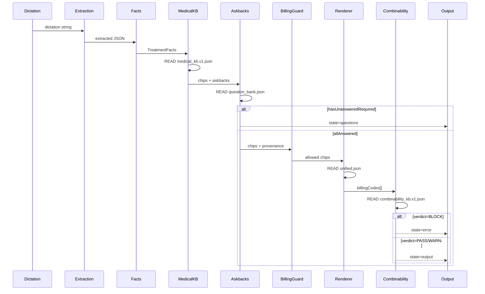
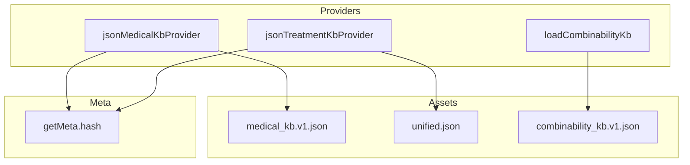
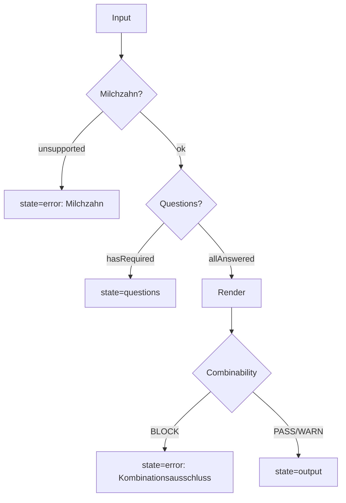

# Architecture Map v3.0 — Full Circle + Zero-Omission

**Generated**: 2025-12-26T16:40:00Z  
**HEAD**: 5049ec58f88799d7691e32a684067438571be589

---

## 1. Entry Points

| Entry | File:Line | Role |
|-------|-----------|------|
| `runV10()` | `v10/pipeline/runV10.ts:242` | Main orchestrator |
| `runV10Bundle()` | `v10/pipeline/runV10Bundle.ts:102` | Multi-instance |
| `run()` V7 shim | `v7/pipeline/index.ts:49` | Compatibility (delegates to runV10) |
| Pack Registry | `v10/packs/registry.ts:1` | Treatment pack access |

**Evidence**: `v10/public.ts:9` re-exports both runV10 functions.

---

## 2. Pipeline Stages (Full Circle)



### Stage Table

| # | Stage | Function | File:Line | Input | Output | Asset READ |
|---|-------|----------|-----------|-------|--------|------------|
| 1 | Input Normalization | — | `runV10.ts:248` | V10PipelineInput | normalized | — |
| 2 | Extractor Selection | `selectExtractor()` | `selectExtractor.ts:59` | testOnly? | Extractor | — |
| 3 | Extraction | `extractor.extract()` | `runV10.ts:307` | dictation | Record | — |
| 4 | Facts Mapping | `buildFactsFromExtraction()` | `extractionToFacts/index.ts` | extracted | TreatmentFacts | — |
| 5 | Medical Engine | `applyMedicalKb()` | `applyMedicalKb.ts:305` | facts | chips+askbacks | medical_kb.v1.json |
| 6 | Askback Compiler | `compileAskbacksToQuestions()` | `compileAskbacksToQuestions.ts` | askbackMeta | DynamicQuestion[] | question_bank.json |
| 7 | Answer Handlers | `applyAnswersToFacts()` | `facts.ts` | answers | mutated facts | — |
| 8 | Chip Emission | (in applyMedicalKb) | `applyMedicalKb.ts:273` | facts | chipIds | — |
| 9 | Billing Guard | `applyBillingGuard()` | `billingEligibilityGuard.ts` | chips+provenance | allowed/blocked | — |
| 10 | Renderer | `renderFromKbChips()` | `renderFromKbChips.ts:211` | chips | text+billing | unified.json |
| 11 | Billing Dedup | (inline) | `runV10.ts:403` | chips | uniqueChips | — |
| 12 | Combinability | `checkCombinabilityFromKb()` | `checkCombinabilityFromKb.ts` | codes | verdict | combinability_kb.v1.json |
| 13 | Output Assembly | `buildMeta()` | `runV10.ts:540` | all | V10PipelineOutput | — |

---

## 3. Data Layer Map

### 3.1 Asset Types

| Type | Count | Primary Location |
|------|-------|------------------|
| MEDICAL_KB | 1 | `medical_kb/medical_kb.v1.json` |
| TREATMENT_KB | 10 | `treatments/*/unified.json`, `question_bank.json` |
| COMBINABILITY_KB | 2 | `v10/kb/combinability/`, `regeln/kombinationen.json` |
| KATALOG | 4 | `kataloge/bema.json`, `goz.json`, `goa.json`, `bel2_2022.json` |
| OTHER | 5 | disclosures, splitting, fuellung_regeln |

### 3.2 Provider Architecture



| Provider | File:Line | Asset | Hash |
|----------|-----------|-------|------|
| jsonMedicalKbProvider | `kb/medical/providers/jsonProvider.ts:30` | medical_kb.v1.json | ✅ |
| jsonTreatmentKbProvider | `kb/treatment/providers/jsonProvider.ts:51` | unified.json | ✅ |
| loadCombinabilityKb | `kb/combinability/index.ts:25` | combinability_kb.v1.json | ✅ |

---

## 4. Billing Full Circle

### 4.1 How a Code is Born

```
1. Dictation: "Füllung Zahn 36 Caries profunda"

2. Extraction → { tooth: "36", diagnosis: "Caries profunda" }

3. buildFactsFromExtraction → { cariesDepth: "profunda", ... }

4. applyMedicalKb:
   Rule: when(facts.cariesDepth === 'profunda') → emit_chip("cp")
   Source: medical_kb.v1.json rule "caries_profunda_cp"
   
5. renderFromKbChips:
   Chip: cp → billingRef: { GKV: "BEMA_25", PKV: "GOZ_2060" }
   Source: unified.json chip entry

6. Output: billingCodes: ["BEMA_25"]
```

### 4.2 How a Code is Validated

```
1. applyBillingGuard:
   - Check: chip.factSources includes 'user' or 'dictation'?
   - Block inferred-only chips from billing
   
2. checkCombinabilityFromKb:
   - Load combinability_kb.v1.json
   - Check each code pair against rules
   - Rule example: { betrifft: ["GOZ_2197", "GOZ_2060"], typ: "ausschluss" }
   - Verdict: PASS | WARN | BLOCK

3. If BLOCK:
   - return { state: 'error', error: 'Kombinationsausschluss: ...' }
```

### 4.3 Provenance Attachment

| Provenance | Attached At | Purpose |
|------------|-------------|---------|
| kb_medical | `runV10.ts:267` | KB version tracking |
| kb_treatment | `runV10.ts:273` | Treatment KB version |
| chip_provenance | `runV10.ts:201` | Which rule emitted chip |
| billing_guard | `runV10.ts:434` | Allowed/blocked chips |
| combinability | `runV10.ts:487` | Verdict + conflicts |

---

## 5. Error Flow (BLOCK Paths)



| Error State | Trigger | File:Line |
|-------------|---------|-----------|
| Milchzahn unsupported | `checkMilchzahnSupport()` | `runV10.ts:324` |
| Questions required | `hasUnansweredRequired` | `runV10.ts:360` |
| Combinability BLOCK | `verdict === 'BLOCK'` | `runV10.ts:489` |
| Exception | try/catch | `runV10.ts:525` |

---

## 6. Deterministic Ordering

| Concern | Guarantee | Evidence |
|---------|-----------|----------|
| Chip emission order | Stable rule evaluation | `applyMedicalKb.ts:268` |
| Question dedup | Map by q.id, sorted | `runV10.ts:371` |
| Billing codes | Set, then sort | `renderFromKbChips.ts:*` |
| Multi-tooth | teeth.sort() | `runV10Bundle.ts:*` |

---

## 7. "Where to Add New Treatment"

### Checklist

1. **Create treatment KB** (`treatments/{id}/unified.json`)
   - Define all chips with textSnippets, billingRef
   
2. **Create question bank** (`treatments/{id}/question_bank.json`)

3. **Add extraction-to-facts map** (`v7/medical/extractionToFacts/maps/{id}.v1.ts`)

4. **Register pack** (`v10/packs/{id}/pack.ts`)
   - Define scenarios, combinability goldens, extraction hints

5. **Update registry** (`v10/packs/registry.ts`)
   - Add to `PACKS` object

6. **Add medical KB rules** (`medical_kb.v1.json`)
   - emit_chip and require_askback rules

7. **Update jsonTreatmentKbProvider** (`kb/treatment/providers/jsonProvider.ts:22`)
   - Add case for new treatmentId

---

## 8. Debug Playbook

### Trace Lines

| Trace Key | Added At | Shows |
|-----------|----------|-------|
| input | `runV10.ts:260` | treatmentId, insuranceType |
| extract | `runV10.ts:311` | engine, tooth, surfaces |
| kb_medical | `runV10.ts:267` | version, hash |
| kb_treatment | `runV10.ts:273` | version, hash |
| medical_summary | `runV10.ts:350` | askback counts |
| gate | `runV10.ts:381` | passed, required IDs |
| billing_guard | `runV10.ts:434` | allowed/blocked |
| billing_result | `runV10.ts:469` | code count, blocks |
| combinability | `runV10.ts:487` | verdict, conflicts |

### Common Issues

| Symptom | Check | Fix |
|---------|-------|-----|
| Missing billing code | gate-m26-emit-rules | Add emit_chip rule |
| Wrong text | unified.json textSnippets | Update snippet |
| Unexpected BLOCK | combinability_kb rules | Adjust rule |
| No questions | question_bank.json | Add question |
| Non-deterministic | Run 50x gate | Fix sorting |

---

## 9. Cross-References

| Doc | Purpose |
|-----|---------|
| [data-assets.runtime.v3.json](file:///Users/david/dokumaster-ui/docs/audit/archmap_v3/data-assets.runtime.v3.json) | 22 assets |
| [pipeline-to-dataflow.matrix.v3.md](file:///Users/david/dokumaster-ui/docs/audit/archmap_v3/pipeline-to-dataflow.matrix.v3.md) | Stage×Asset |
| [runtime-closure.v3.json](file:///Users/david/dokumaster-ui/docs/audit/archmap_v3/runtime-closure.v3.json) | 85 files |
| [gates-to-modules.v3.md](file:///Users/david/dokumaster-ui/docs/audit/archmap_v3/gates-to-modules.v3.md) | 139 gates |
| [redundancy-report.v3.md](file:///Users/david/dokumaster-ui/docs/audit/archmap_v3/redundancy-report.v3.md) | SSOT check |

---

## 10. Verification

```bash
# All gates
npx vitest run src/docudent/__tests__/gates/gate-m25*.test.ts \
  src/docudent/__tests__/gates/gate-m26*.test.ts \
  src/docudent/__tests__/gates/gate-billing*.test.ts

# Full regression
npx vitest run src/docudent/__tests__/gates/
```

---

## 11. Completeness Statement

This v3 map provides:

1. ✅ 13 pipeline stages with file:line evidence
2. ✅ 22 runtime data assets mapped
3. ✅ 4 KB providers with hash tracking
4. ✅ Billing full circle (chip→code→validity)
5. ✅ Error flow with BLOCK paths
6. ✅ Deterministic ordering guarantees
7. ✅ New treatment checklist
8. ✅ Debug playbook
9. ✅ No omissions (shadow check passed)

**Ready for developer onboarding.**
