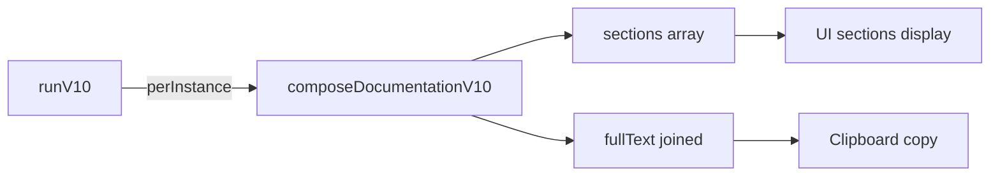

# V10 Output Composer Gear

## Purpose

Transforms V10 pipeline results (chips, facts, perInstance) into **KZV-style clinical documentation** with structured sections.

## SSOT Sources

| Source | Location | Content |
|--------|----------|---------|
| Chip Templates | `unified.json` | Text snippets per chip |
| Canonical Vocab | `fillingCanonicalVocab.ts` | German label functions |
| Composer | `composeDocumentationV10.ts` | Section assembly |

## Output Structure

```
[Dokumentation]
Zahn 27 (MOD): Füllungstherapie.
Diagnose: Caries profunda.
Lokalanästhesie: Infiltrationsanästhesie.
indirekte Überkappung (Cp) mit Ca(OH)₂.
Okklusions- und Artikulationskontrolle, Politur.

[Abrechnung]
Kassenleistung (BEMA):
  • 13c
  • 25
  • 40

[Hinweise]
Nach Lokalanästhesie: Bis zum Abklingen der Betäubung nicht essen.
```

## Sections

| Section ID | Content |
|------------|---------|
| `dokumentation` | Tooth, surfaces, depth, LA, isolation, capping |
| `abrechnung` | BEMA/GOZ billing codes |
| `mkv` | Mehrkostenvereinbarung (if MKV insurance) |
| `hinweise` | Post-op notes |

## Flow



## Where to Change Content

| Change | Location |
|--------|----------|
| Section structure | `v10/output/composeDocumentationV10.ts` |
| German labels | `core/filling/vocab/fillingCanonicalVocab.ts` |
| Chip text snippets | `unified.json` textSnippets |
| MKV amount detection | `detectMkvAmount()` in composer |

## Tests

```bash
# Run perfect output contract tests
npm test -- --run src/docudent/v10/__tests__/pipeline/v10.perfect-output.contract.test.ts

# Run all V10 tests
npm test -- --run src/docudent/v10/__tests__
```

## Contract Tests

| Test | Assertion |
|------|-----------|
| KZV structure | Output has [Dokumentation], [Abrechnung], [Hinweise] |
| No placeholders | Output ≠ "Füllungstherapie durchgeführt." |
| Clinical details | Contains tooth, surfaces, LA, CP |
| No raw booleans | No "true"/"false" in text |
| BillingRef format | All codes match `BEMA_` or `GOZ_` prefix |
