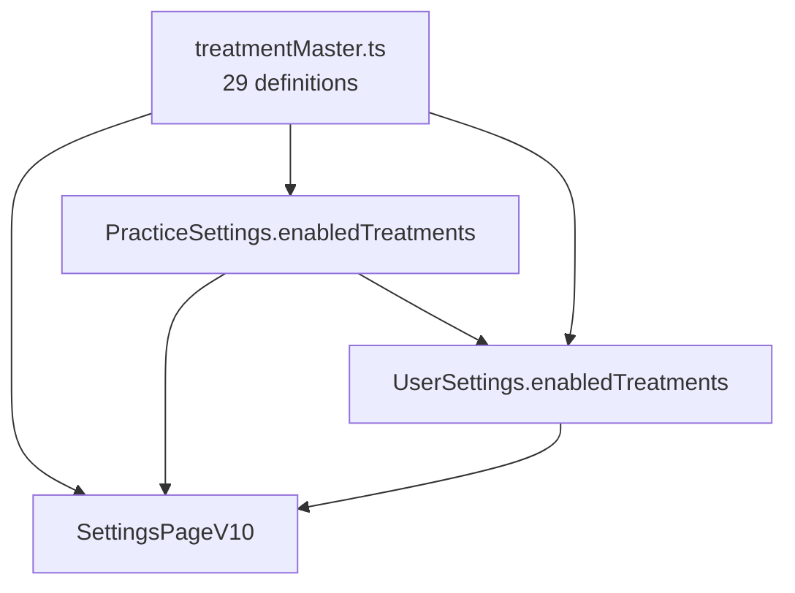

# Treatment Registry — SSOT for Dental Treatments

**Updated:** 2026-01-30  
**Status:** Draft (needs verification of billing refs against official sources)  
**Location:** `src/docudent/v10/settings/treatmentMaster.ts`

---

## Purpose

Central source of truth for all dental treatment types offered in the Dokusoftware. Defines:
- Treatment IDs + labels (German)
- Detection keywords (for matching / future detection)
- Workflow phases (clinical steps)
- Documentation requirements (required / recommended / forensic)
- Configurable defaults for settings
- No billing logic: Billing comes from the KB (Firestore/JSON provider) and is the SSOT

---

## Architecture Diagram



---

## Treatment Categories (12)

| Key | Label | Count |
|-----|-------|-------|
| `konservierend` | Konservierend | 2 |
| `endodontie` | Endodontie | 1 |
| `chirurgie` | Chirurgie | 4 |
| `parodontologie` | Parodontologie | 2 |
| `prophylaxe` | Prophylaxe | 2 |
| `prothetik_fest` | Prothetik (festsitzend) | 6 |
| `prothetik_heraus` | Prothetik (herausnehmbar) | 3 |
| `aesthetik` | Ästhetik | 1 |
| `funktion` | Funktionstherapie | 2 |
| `kinderzahn` | Kinderzahnheilkunde | 2 |
| `diagnostik` | Diagnostik | 2 |
| `notfall` | Notfall | 2 |

**Total:** 29 treatment types

---

## Treatment Definition Structure

```typescript
interface TreatmentDefinition {
    id: string;                    // e.g. 'fuellung'
    version: string;               // e.g. '1.0.0'
    label: string;                 // e.g. 'Füllung / Restauration'
    labelShort: string;            // e.g. 'Füllung'
    category: TreatmentCategory;
    icon?: string;
    
    detection: {
        keywords: string[];        // For dictation recognition
        conditions?: Record<string, unknown>;
    };
    
    workflow: {
        phases: Array<{
            id: string;
            label: string;
            steps: string[];
        }>;
    };
    
    documentation: {
        required: Array<{ field: string; label: string }>;
        recommended?: Array<{ field: string; label: string }>;
        forensic?: Array<{ field: string; label: string }>;
    };
    
    configurableDefaults?: string[];  // User-settable defaults
}
```

---

## Settings Integration Flow

### PracticeSettings
```typescript
// src/docudent/v10/settings/settingsTypes.ts
enabledTreatments?: string[];  // IDs from treatmentMaster
```

### UserSettings
```typescript
enabledTreatments?: string[];  // Subset of practice.enabledTreatments
```

### UI Flow
1. **Praxis → Behandlungen**: Admin selects which treatments the practice offers
2. **Benutzer → Behandlungen**: User selects from practice-enabled treatments
3. (Optional) Per-treatment defaults can later be configured once user enables a treatment

---

## Usage Examples

```typescript
import { 
    TREATMENT_DEFINITIONS, 
    TREATMENT_IDS, 
    TREATMENT_LABELS,
    getTreatmentById,
    getTreatmentsByCategory 
} from '../settings/treatmentMaster';

// Get all treatment IDs
const allIds = TREATMENT_IDS; // ['fuellung', 'endo', ...]

// Get label for UI
const label = TREATMENT_LABELS['fuellung']; // 'Füllung / Restauration'

// Get full definition
const def = getTreatmentById('endo');
console.log(def.workflow.phases); // [{id: 'eroeffnung', ...}, ...]

// Filter by category
const chirurgisch = getTreatmentsByCategory('chirurgie');
```

---

## Data Sources

Billing ist bewusst nicht in `treatmentMaster.ts` hardcoded. SSOT fuer Billing/Chips/Rules ist die Treatment-KB.
Der Provider ist austauschbar. Aktuell gibt es:
- JSON (default) als lokal versioniertes Artifact (Repo) und
- optional Firestore (feature-flagged) fuer remote Updates ohne Redeploy.

Wenn Firestore nur fuer Praxis/User-Settings genutzt werden soll: `VITE_KB_FIRESTORE=false` lassen und bei JSON bleiben (oder spaeter einen eigenen API-Provider anbinden).

Implementiert:
- `src/docudent/v10/kb/treatment/providers/firestoreProvider.ts`
- Collection: `medical_kb/{version}/treatments/{treatmentId}`
- Flags: `VITE_KB_FIRESTORE=true` und optional `VITE_KB_FIRESTORE_VERSION=<version>`

| Source | Used For |
|--------|----------|
| KZBV / BEMA | GKV-Leistungen (BEMA) |
| KZBV / GOZ | PKV-Leistungen (GOZ) |
| G-BA Richtlinien | Behandlungsrichtlinien (z.B. PAR) |
| AWMF / DGZMK Leitlinien (falls relevant) | Klinische Leitlinien (z.B. Zahntrauma) |

---

## Files Changed

| File | Change |
|------|--------|
| `v10/settings/treatmentMaster.ts` | **NEW** — SSOT for treatments |
| `v10/settings/settingsTypes.ts` | Added `enabledTreatments` to PracticeSettings |
| `v10/settings/useSettings.ts` | Persist/load `PracticeSettings.enabledTreatments` (localStorage + optional Firestore) |
| `v10/pages/SettingsPageV10.tsx` | Praxis- und Benutzer-UI fuer Behandlungen (28), User-Auswahl = Subset der Praxis-Auswahl |

---

## Related Docs

- [settings.design.md](./settings.design.md) — Settings architecture
- [contracts.md](./contracts.md) — Runtime contracts
- [gears.md](./gears.md) — V10 pipeline gears
