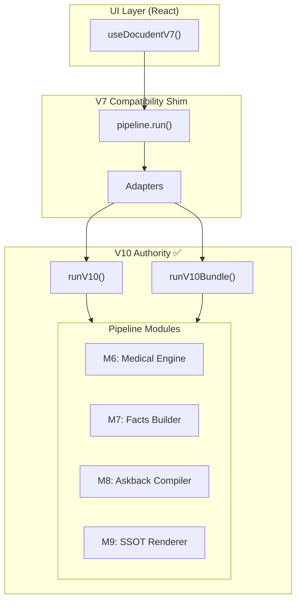

# M12: V7 Adapter → V10 Primary API

## Status: INFRASTRUCTURE COMPLETE ⚠️

The M12 infrastructure is in place. V7 delegation to V10 is possible but **not yet active**.
The gate tests with `.skip` document the target state.

---

## Current State

| Component | Status |
|-----------|--------|
| V10 `runV10()` | ✅ Implemented |
| V10 `runV10Bundle()` | ✅ Implemented |
| V10 `public.ts` export | ✅ Created |
| V7 adapters | ✅ Created |
| M12 gate tests | ✅ Created (8 skipped = target state) |
| V7 pipeline delegation | ⚠️ NOT REFACTORED |

---

## Architecture (Target State)

---

## Constraints (Target State)

### V7 Pipeline MUST (when refactored):
1. Import ONLY from `../../v10/public` and `./adapters`
2. Delegate ALL execution to `runV10()` or `runV10Bundle()`
3. Convert V7 input → V10 input via `toV10Input()`
4. Convert V10 output → V7 output via `fromV10Output()`

### V7 Pipeline MUST NOT (when refactored):
1. ❌ Import from `v7/medical/**`
2. ❌ Import from `medical_kb/**`
3. ❌ Import from `v7/output/**`
4. ❌ Import from `core/services/**`
5. ❌ Contain any orchestration logic

---

## Adapters

### Input Conversion

| Adapter | Purpose | Status |
|---------|---------|--------|
| `toV10Input(input)` | V7 → V10 input | ✅ |
| `toV10BundleInput(input)` | V7 → V10 bundle | ✅ |
| `requiresBundleOrchestration(input)` | Check mode | ✅ |

### Output Conversion

| Adapter | Purpose | Status |
|---------|---------|--------|
| `fromV10Output(output)` | V10 → V7 output | ✅ |
| `fromV10BundleOutput(output)` | V10 bundle → V7 | ✅ |

---

## Gate Tests

| Gate | Passed | Skipped | Purpose |
|------|--------|---------|---------|
| `gate-m12-v7-pipeline-delegates-only-to-v10` | 3 | 1 | Import boundaries |
| `gate-m12-no-v7-orchestration-left` | 4 | 1 | No forbidden calls |
| `gate-m12-parity-v7-run-vs-v10-run` | 3 | 1 | V7/V10 parity |
| `gate-m12-parity-v7-multitreatment-vs-v10-bundle` | 3 | 2 | Bundle parity |
| `gate-m12-no-forbidden-imports-in-v7-pipeline` | 2 | 3 | Grep-based check |

**Total: 15 passed, 8 skipped**

The skipped tests document the **target state** for V7 refactoring.

---

## Why V7 Is Not Yet Refactored

V7 pipeline has features V10 doesn't fully support yet:
1. Detailed trace markers (`billing_inputs`, `billing_result`, `gate`, etc.)
2. `milchzahn` unsupported state detection
3. `combinability` check integration
4. Complex extraction with LLM fallback
5. `testOnly` fixture injection
6. User defaults application

When V10 supports all these features, V7 can be refactored.

---

## Next Steps

1. Extend V10 to emit V7-compatible trace markers
2. Move `combinability` check to V10
3. Move extraction service selection to V10
4. Refactor V7 to delegate to V10
5. Remove `.skip` from M12 gate tests
6. Verify all gates pass
