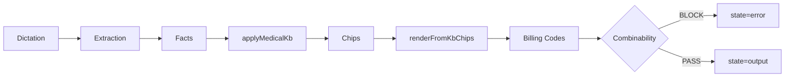

# V10 Onboarding — Executive Summary

**Last Updated**: 2025-12-26  
**Source**: [architecture-map.v3.md](../../../audit/archmap_v3/architecture-map.v3.md)

---

## What is This System?

Docudent V10 is a **dental documentation pipeline** that transforms dictation into billing-compliant output.

```
Dictation → Extraction → Facts → Medical Rules → Chips → Text + Billing Codes
```

---

## What is SSOT?

**Single Source of Truth** — every piece of data comes from exactly one authoritative source:

| Data Type | SSOT Location |
|-----------|---------------|
| Medical rules | [medical_kb.v1.json](src/docudent/medical_kb/medical_kb.v1.json) |
| Text/Billing | [treatments/*/unified.json](src/docudent/core/billing/knowledgeBase/treatments/) |
| Questions | [treatments/*/question_bank.json](src/docudent/core/billing/knowledgeBase/treatments/) |
| Combinability | [combinability_kb.v1.json](src/docudent/v10/kb/combinability/combinability_kb.v1.json) |

---

## Full Circle Dataflow



---

## Hard Guards

| Guard | File | What It Prevents |
|-------|------|------------------|
| No billing mismatch | [gate-m26-no-billing-mismatch.test.ts](src/docudent/__tests__/gates/gate-m26-no-billing-mismatch.test.ts) | Same chip, different billing |
| No orphan emit rules | [gate-m26-emit-rules-target-valid-chips.test.ts](src/docudent/__tests__/gates/gate-m26-emit-rules-target-valid-chips.test.ts) | Rule emits unknown chip |
| No legacy imports | [gate-billing-no-legacy-imports-runtime.test.ts](src/docudent/__tests__/gates/gate-billing-no-legacy-imports-runtime.test.ts) | v6/_legacy in V10 |
| Determinism | [gate-m21-determinism-50x-endo-core.test.ts](src/docudent/__tests__/gates/gate-m21-determinism-50x-endo-core.test.ts) | Non-deterministic output |

---

## Top 10 Failure Modes

| # | Failure | Prevented By |
|---|---------|--------------|
| 1 | Chip emitted without KB entry | gate-m26-emit-rules |
| 2 | billingRef mismatch in common chip | gate-m26-no-billing-mismatch |
| 3 | Text rendered without chip | No hardcoded text in runtime |
| 4 | Hardcoded billing code | gate-billing-no-legacy-imports |
| 5 | Combinability rule bypassed | runV10 always calls check |
| 6 | Shadow unified.json | gate-m25-no-chipid-collision |
| 7 | Legacy v6 import | gate-billing-no-legacy-imports |
| 8 | KB hash stale | Provider recomputes on load |
| 9 | Unconfirmed fact drives billing | BillingGuard blocks inferred |
| 10 | Text drift without approval | gate-m26-text-drift-explicit |

---

## Quick Links

- [60-Minute Route](./60min-route.md)
- [Full Circle Map](./full-circle-map.md)
- [Debug Playbook](./debug-playbook.md)
- [Run Gates](#run-gates)

### Run Gates

```bash
npx vitest run src/docudent/__tests__/gates/gate-m25*.test.ts \
  src/docudent/__tests__/gates/gate-m26*.test.ts
```
