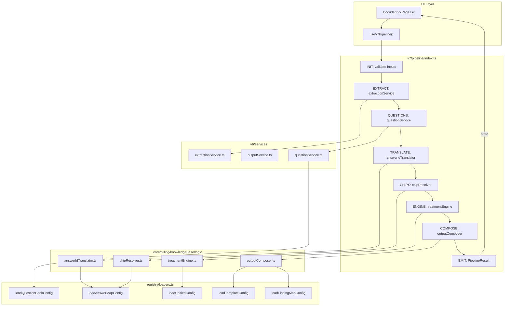
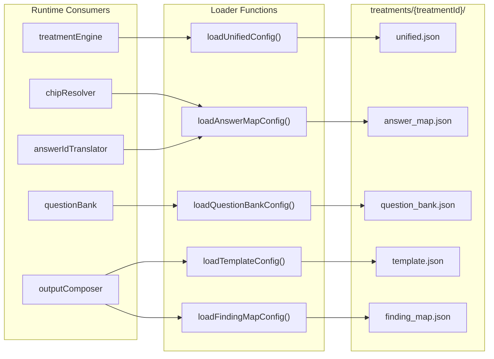
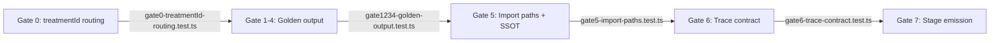

# Docudent Architecture

## 1. Runtime Pipeline Flow



## 2. SSOT Registry Dependency Graph



## 3. Gates Map



## 4. Module Map

```
WHERE TO FIND:

├── EXTRACTION        → v6/services/extractionService.ts
├── QUESTIONS         → v6/services/questionService.ts
│                     → core/billing/knowledgeBase/questions/questionBank.ts
├── TRANSLATION       → core/billing/knowledgeBase/logic/answerIdTranslator.ts
├── CHIPS             → core/billing/knowledgeBase/logic/chipResolver.ts
├── BILLING           → core/billing/knowledgeBase/logic/treatmentEngine.ts
├── COMPOSITION       → core/billing/knowledgeBase/logic/outputComposer.ts
├── REGISTRY          → core/billing/knowledgeBase/registry/loaders.ts
├── SSOT FILES        → core/billing/knowledgeBase/treatments/{treatmentId}/
├── GATES             → __tests__/gates/
└── LEGACY (gated)    → knowledgeBase/{behandlungen,mappings,templates}/
```
