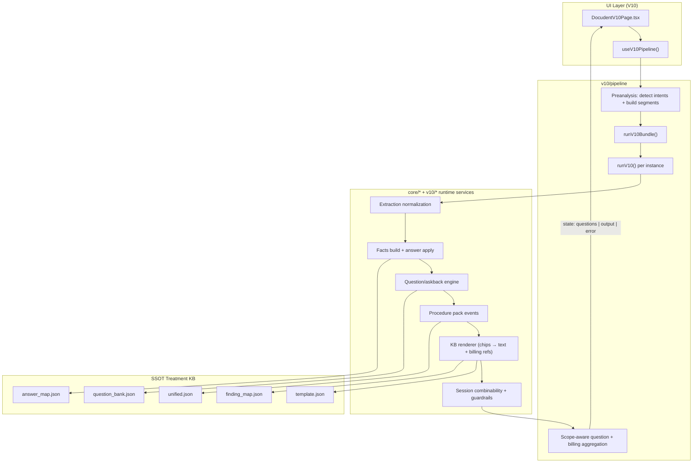
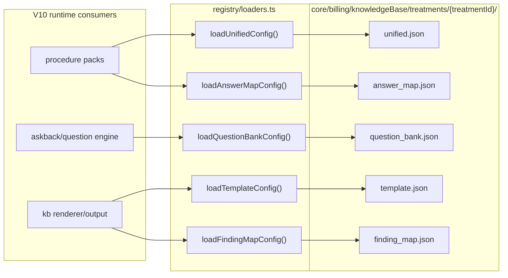
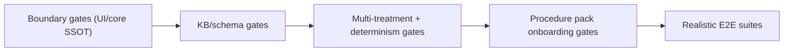

# Docudent Architecture (V10)

## 1. Runtime Pipeline Flow



## 2. SSOT Invariants

- `copyText` is derived from `blocks` (never built independently).
- UI is renderer-only for billing semantics (no hardcoded billing rules in UI).
- Billing codes are resolved from KB/DB-backed rules, then validated by combinability.
- Multi-treatment output is deterministic (stable ordering + stable hash gates).

## 3. Registry Dependency Graph



## 4. Gate Coverage Map



## 5. Module Map

```
WHERE TO FIND (V10 FOCUS):

├── V10 UI ROUTING         → v10/app/V10Router.tsx
├── PIPELINE ORCHESTRATION → v10/pipeline/runV10.ts
│                           v10/pipeline/runV10Bundle.ts
├── PREANALYSIS/SEGMENTS   → v10/preanalysis/*
│                           v10/multitreatment/*
├── FACTS + ANSWERS        → v10/facts/*
├── QUESTIONS/ASKBACKS     → v10/askbacks/*
├── PROCEDURE PACKS        → v10/packs/*
├── BILLING SESSION CHECKS → v10/billing/sessionCombinability.ts
├── KB RENDERING           → v10/renderer/renderFromKbChips.ts
├── SSOT KB FILES          → core/billing/knowledgeBase/treatments/{treatmentId}/
├── MANIFEST IDS           → contracts/treatments.manifest.ts
├── V10 GATES              → v10/__tests__/gates/
└── LEGACY/FROZEN          → v7/* (compat renderer), v6/* (no new code)
```
