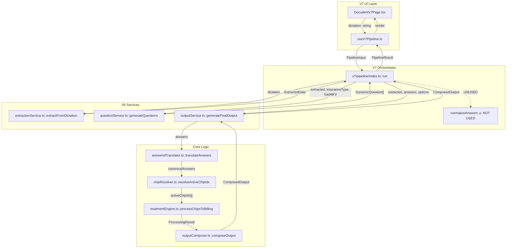

# V7 Pipeline — Real Call Chain Flowchart

## Mermaid Diagram

---

## Data Artifacts at Each Step

| Step | Function | Input | Output |
|------|----------|-------|--------|
| 1 | `extractFromDictation` | `dictation: string` | `ExtractedData { tooth, surfaces, diagnosis, costs, mentioned, gaps }` |
| 2 | `generateQuestions` | `extracted, insuranceType, hasMKV` | `DynamicQuestion[] { id, question, options, category }` |
| 3 | `normalizeAnswers` ⚠️ | `treatmentId, answers` | **OUTPUT NOT USED** |
| 4 | `generateFinalOutput` | `extracted, answers, insuranceType, textLength, hasMKV` | `ComposedOutput` |
| 4a | `translateAnswers` | `treatmentId, answers` | `canonicalAnswers` (this is what matters!) |
| 4b | `resolveActiveChipIds` | `treatmentId, extracted, canonicalAnswers, options` | `activeChipIds[]` |
| 4c | `processChipsToBilling` | `treatmentId, activeChipIds, insuranceType, ...` | `ProcessingResult { billingCodes, billingDetails, warnings }` |
| 4d | `composeOutput` | `treatmentId, engineResult, activeChips, extractedData, insuranceType, composeOptions` | `ComposedOutput { sections, fullText, billingCodes, warnings }` |

---

## Key Insight

The arrow from `v7/pipeline/index.ts` to `normalizeAnswers` is **dotted** because:

1. `normalizeAnswers()` IS called
2. Its output `canonicalAnswers` is logged to debug
3. But the **raw `answers`** Map is passed to `generateFinalOutput`
4. V6's `answerIdTranslator.translateAnswers()` does the actual translation

This is the source of confusion: V7 has translation code, but V6 is authoritative.
